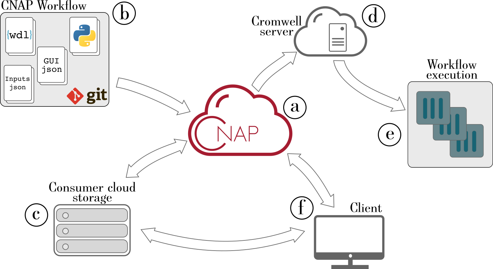
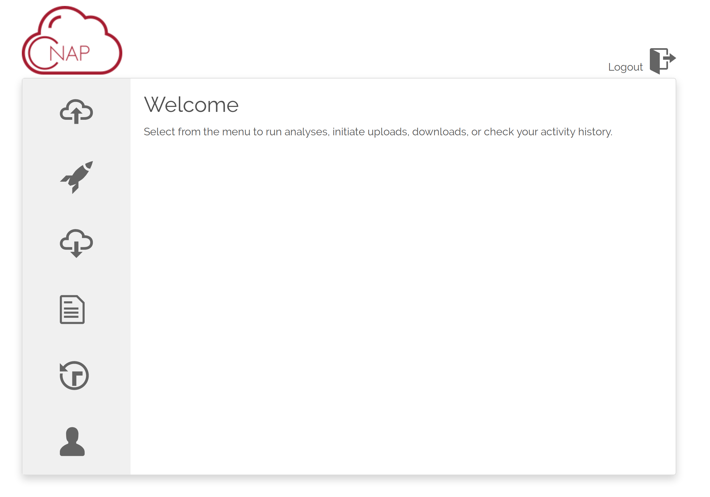
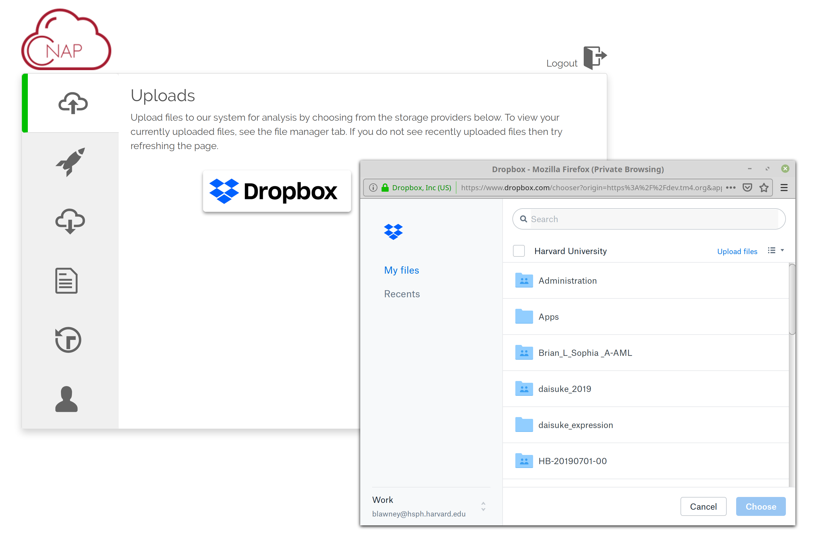
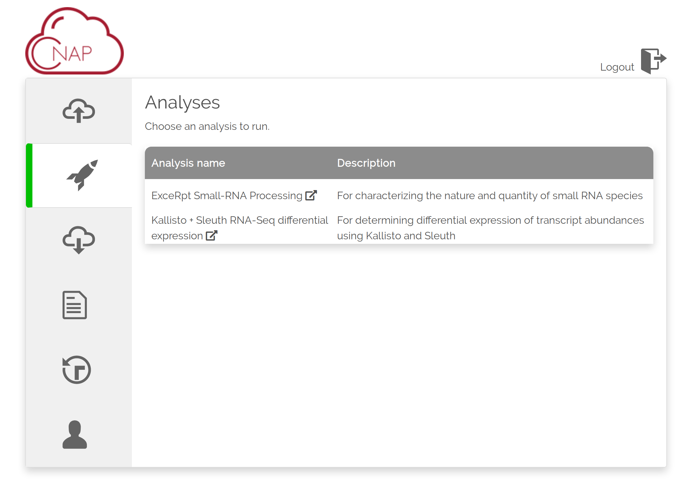
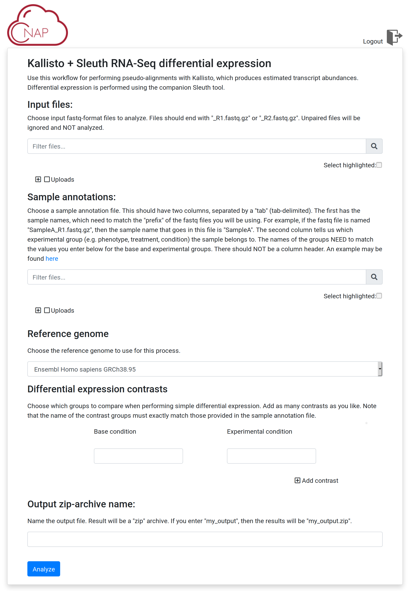

## CNAP

The **C**loud **N**ative **A**nalysis **P**latform is a web-application platform for reproducible, cloud-based data analysis.  CNAP enforces reproducibility in both the application and the computing environment through required git integration and containerization.  It integrates with consumer storage providers such as Dropbox and Google Drive for convenient and rapid data transfer.  

- For details on setting up the CNAP platform on the Google Cloud platform, [see the documentation here](https://github.com/qbrc-cnap/cnap/blob/master/docs/cnap_setup.md).

- For information on creating and integrating CNAP workflows, [see the documentation here](https://github.com/qbrc-cnap/cnap/blob/master/docs/workflows.md)

#### Architecture

The CNAP application (a) handles the ingestion of workflows (b), the transfer of data between consumer cloud storage and cloud platform storage (c), issues workflow requests to a remote Cromwell server (d), and serves web interface to clients (f).  The Cromwell server manages the execution of workflows using containerized pipeline components 

#### Screenshots

**Home**

**Uploads**

**Available analyses**

**Example analysis GUI**

