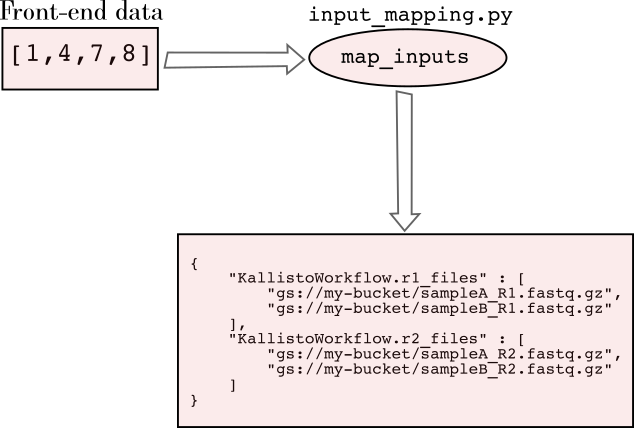
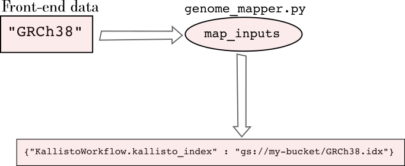

## The CNAP Hello World!

This document describes the very concrete steps of creating a CNAP workflow, with minimal details/explanations to complement.  For a fuller explanation, see the more general discussion in the "workflows" markdown document.

For this simple workflow, we will create a basic workflow that performs transcript quantification using the Kallisto algorithm.  The input will be an arbitrary number of FASTQ files from a RNA-Seq experiment; the output will be "abundance" files in tab-delimited format.

#### 1. Getting started

Create a new directory where the workflow will live, and create the required files.  In a terminal window:
```
$ mkdir hello_world
$ mkdir hello_world/docker
$ cd hello_world
$ touch main.wdl \
    inputs.template.json \
    gui.json \
    docker/Dockerfile
```

For simplicity, we envision there being two inputs (broadly speaking) to this workflow-- the FASTQ files and an identifier for the reference transcriptome (e.g. GRCh38).  Thus, we will plan for a user-interface (GUI) with two inputs: a file chooser and a dropdown for selecting the organism. 

#### 2. Write the workflow

Before concerning ourselves with creating a CNAP workflow, we first need a working WDL-based pipeline.  Thus, we create a `main.wdl` with the following content:

```
workflow KallistoWorkflow{

    Array[File] r1_files
    Array[File] r2_files
    File kallisto_index_path
    Int kallisto_bootstraps = 500

    # Pair-up the R1 and R2 fastq files.  Assumes the inputs are ordered correctly
    Array[Pair[File, File]] fastq_pairs = zip(r1_files, r2_files)

    # scatter each pairing, running the quantifications in parallel:
    scatter(item in fastq_pairs){
        call KallistoQuantification as single_sample_process{
            input:
                r1_fastq = item.left,
                r2_fastq = item.right,
                kallisto_index_path = kallisto_index_path,
                kallisto_bootstraps = kallisto_bootstraps
        }
    }

    output {
        Array[File] abundance_files = single_sample_process.abundance_tsv
    }

    meta {
        workflow_title : "Kallisto transcript quantification"
        workflow_short_description : "For quantifying transcript abundances using Kallisto."
        workflow_long_description : "Use this workflow for performing pseudo-alignments with Kallisto, which produces estimated transcript abundances."
    }
}

task KallistoQuantification {
    File r1_fastq
    File r2_fastq
    File kallisto_index_path
    Int kallisto_bootstraps

    Int threads = 2
    Int disk_size = 30

    # Extract the samplename from the fastq filename
    String sample_name = basename(r1_fastq, "_R1.fastq.gz")

    command {
        kallisto quant -i ${kallisto_index_path} \
            -o "kallisto_results_${sample_name}" \
            -b ${kallisto_bootstraps} \
            -t ${threads} \
            ${r1_fastq} \
            ${r2_fastq}

        mv "kallisto_results_${sample_name}/abundance.h5" "${sample_name}.abundance.h5"
    }

    output {
        File abundance_tsv = "${sample_name}.abundance.tsv"
    }

    runtime {
        zones: "us-east4-c"
        docker: "docker.io/blawney/kallisto:v0.0.1"
        cpu: 4
        memory: "5 G"
        disks: "local-disk " + disk_size + " HDD"
        preemptible: 0
    }
}
```
In short, this runs Kallisto on each set of paired-end fastq files, one pair per sample.  The output of the process is a series of quantification files, one for each sample.

Note in the `runtime` section that we defined a Docker container; this is required by Cromwell when running on Google Cloud platform, but CNAP further requires that the Docker container is tagged (`v0.0.1` here).  Also not that we have *not* created this Docker container yet.  

At this point, one can run Broad's WOMTool "inputs" module, or create an inputs file `inputs.template.json` manually.  If you use WOMTool, remove the optional inputs.  This would be:

```
{
  "KallistoWorkflow.r2_files": "Array[File]",
  "KallistoWorkflow.r1_files": "Array[File]",
  "KallistoWorkflow.kallisto_index_path": "File"
}
```

#### 3. Create the Dockerfile for the runtime environment

In the WDL above, we declared a Docker container image, but we did not actually create one yet.  In the `docker/Dockerfile` file, add the following:

```
FROM debian:stretch

RUN apt-get update && \
    apt-get install -y build-essential wget

# Install all software under /opt/software:
RUN mkdir -p /opt/software 

# Get the miniconda installer script and run it in silent mode:
RUN wget https://repo.anaconda.com/miniconda/Miniconda3-latest-Linux-x86_64.sh -O /opt/software/miniconda.sh && \
  bash /opt/software/miniconda.sh -b -p /opt/software/miniconda
ENV PATH="/opt/software/miniconda/bin:${PATH}"

# install kallisto and sleuth via conda
RUN conda config --add channels defaults && \
  conda config --add channels bioconda && \
  conda config --add channels conda-forge && \
  conda install -y kallisto 

ENTRYPOINT ["/bin/bash"]
```

Now, build and push this image:
```
$ cd docker/
$ docker build -t blawney/kallisto:v0.0.1 .
$ docker push blawney/kallisto:v0.0.1
```

#### 4. Prepare the necessary companion files

Before we are able to test our workflow (independent of CNAP), we first need to create a Kallisto index.  Details of making a Kallisto index are outside the scope of this walk-through, so we only note that the index files were uploaded to a storage bucket at `gs://my-bucket/GRCh38.idx` (using the GRCh38 reference here).

#### 5. Test the workflow

At this point, the WDL file, the inputs JSON, and the presence of the Docker container are enough to submit a job to your Cromwell server.

If you have data in a Google cloud bucket, choose the fastq files you will be using and fill-out the inputs JSON file with actual values (here, analying only two samples).  Call this file `final_inputs.json`:

```
{
  "KallistoWorkflow.r2_files": ["gs://my-bucket/sampleA_R2.fastq.gz","gs://my-bucket/sampleB_R2.fastq.gz"],
  "KallistoWorkflow.r1_files": ["gs://my-bucket/sampleA_R1.fastq.gz","gs://my-bucket/sampleB_R1.fastq.gz"],
  "KallistoWorkflow.kallisto_index_path": "gs://my-bucket/GRCh38.idx"
}
```
And submit the job to your Cromwell server:
```
$ curl -X POST "<CROMWELL URL>/api/workflows/v1" \
    -H  "accept: application/json" \
    -H  "Content-Type: multipart/form-data" \
    -F "workflowSource=@main.wdl" 
    -F "workflowInputs=@final_inputs.json" \
    -F "workflowType=WDL" \
    -F "workflowTypeVersion=draft-2"
```

There is not much that can go wrong with only a single step pipeline, but in general this is a good place to perform debugging.  Ideally the process captured in the WDL file(s) should be error-free and robust prior to integrating with CNAP.

#### 6. Plan and define your GUI

Above, the inputs JSON (`inputs.template.json`) had effectively two inputs: the fastq files and the Kallisto index.  To non-bioinformatics scientists, this index is meaningless-- and therefore, it would generally be unnecessary that front-end users know about it.  Rather, the important point is that they will be using the GUI to select their model organism (human, mouse, etc).  Thus, our GUI will have two elements-- a file-chooser and a dropdown.  We will demonstrate how we can use Python module's to "translate" the genome choice to ultimately provide the correct index as input to the WDL process.

The full specification on creating a `gui.json` can be found in the documentation, but it is often much easier to copy an existing one from another workflow that meets your needs.  The `gui.json` below creates two input elements-- a file chooser (limited to displaying files ending with "_R1.fastq.gz" or "_R2.fastq.gz") and a dropdown with human and mouse genomes.  (Here we assume that a mouse index was also created and uploaded to a cloud bucket).

```
{
    "input_elements": [
        {
            "target": {
                "target_ids": ["KallistoWorkflow.r1_files", "KallistoWorkflow.r2_files"],
                "name": "input_files",
                "handler": "input_mapping.py"
            },
            "display_element": {
                "type": "file_chooser",
                "regex_filter": ".*_R[1,2].fastq.gz",
                "label": "Input files:",
                "choose_multiple": true,
                "description": "Choose input fastq-format files to analyze.  Files should end with \"_R1.fastq.gz\" or \"_R2.fastq.gz\".  Unpaired files will be ignored and NOT analyzed."
            }	
        },
        {
            "target": {
                "target_ids": ["KallistoWorkflow.kallisto_index_path"],
                "name": "genome_choice",
                "handler": "genome_mapper.py"
            },
            "display_element": {
                "type": "select",
                "label": "Reference genome",
                "description": "Choose the reference genome to use for this process.",
                "choices": [
                    {
                        "value": "GRCh38",
                        "display": "Ensembl Homo sapiens GRCh38.95"
                    },
                    {
                        "value": "GRCm38",
                        "display": "Ensembl Mus musculus GRCm38.95"
                    }
                ]
            }
        }
    ]
}
```

This specification requires us to create two additional Python modules specified by the `handler` keys-- `input_mapping.py` and `genome_mapper.py`.  The former performs the task to transforming primary keys into cloud-based file paths, while the latter takes the genome choice and transforms that into a path to the appropriate Kallisto index.



`input_mapping.py`:

```
from base.models import Resource
import os

def map_inputs(user, unmapped_data, id_list):
    '''
    `user` is a User instance (or subclass).  This gives us
    the option of applying user-specific logic to the mapping.
    Since the code that calls this function does NOT know
    the structure of the input data, it cannot impose any logic
    such as filtering Resource objects for a particular user.
    Therefore we have to keep that information here

    `unmapped_data` is some data structure sent by
    the frontend.  The structure is known to the 
    developer since they specified the input element responsible
    for creating the data.  For example, a file chooser will send
    a list/array of primary keys.

    `id_list` is a list of WDL input "names"/ids that we are mapping
    to.  Note that the ordering is important.  Make sure the logic below
    matches the order in gui.json 

    '''
    r1_suffix = '_R1.fastq.gz'
    r2_suffix = '_R2.fastq.gz'
    r1_path_list = []
    r2_path_list = []
    for pk in unmapped_data:
        r = Resource.objects.get(pk=pk)
        if (r.owner == user) or (user.is_staff):
            if r.path.endswith(r1_suffix):
                r1_path_list.append(r.path)
            elif r.path.endswith(r2_suffix):
                r2_path_list.append(r.path)
            else:
                print('Skipping %s' % r.path)
        else:
            raise Exception('The user %s is not the owner of Resource with primary key %s.' % (user, pk))
    
    # now we have a list of files that had the correct naming scheme.
    # Need to check for pairing:
    r1_samples = [os.path.basename(x)[:-len(r1_suffix)] for x in r1_path_list]
    r2_samples = [os.path.basename(x)[:-len(r2_suffix)] for x in r2_path_list]
    r1_dict = dict(zip(r1_samples, r1_path_list))
    r2_dict = dict(zip(r2_samples, r2_path_list))

    sample_intersection = set(r1_samples).intersection(r2_samples)

    # now have the samples that have both R1 and R2.  Create the final map
    final_r1_list = []
    final_r2_list = []
    for s in sample_intersection:
        final_r1_list.append(r1_dict[s])
        final_r2_list.append(r2_dict[s])
    return {id_list[0]:final_r1_list, id_list[1]:final_r2_list}
```

As explained in the full documentation, these handler functions have defined method signatures which must be followed.  While the function above is a bit long, it simply performs the task of looking up the files (`Resource`s in the CNAP database) and arranging the file paths into a properly sorted list that is ready to be "injected" into the inputs JSON file.



Similarly, the `genome_mapper.py` looks like:

```
def map_inputs(user, unmapped_data, id_list):
    '''
    This maps the genome string to the resources needed to run a WDL
    This is important because Cromwell localizes ALL files, so providing
    a Map[String, File] will pull all the files listed therein.

    unmapped_data is a string giving the genome
    id_list is a list of the WDL input names.  The order is given in the gui.json
    file.
    '''
    kallisto_index_map = {
        'GRCh38': 'gs://my-bucket/GRCh38.idx',
        'GRCm38': 'gs://my-bucket/GRCm38.idx'
    }

    genome_choice = unmapped_data    # e.g. "GRCh38"

    return {id_list[0] : kallisto_index_map[genome_choice]}
```

Instead of hard-coding these paths, one could also create a file containing the `kallisto_index_map` mapping and read that in real-time.  

#### 7. Ingest the workflow into CNAP

At this point, we have all the items necessary for a complete CNAP workflow.  If you have not already done so, create a git repository (`git init`) locally and also create a remote repository (e.g. on github).  Commit these files and push them to that remote repository.  In total, you should commit the following:

- main.wdl
- inputs.template.wdl
- gui.json
- input_mapping.py
- genome_mapper.py
- docker/Dockerfile

With the files in the remote repository, you may now ingest the workflow by visiting `https://<YOUR DOMAIN>/dashboard/` and entering the clone URL into the textbox.

To check the status of the ingestion, it is best to look at the admin page at `https://<YOUR DOMAIN>/admin/analysis/pendingworkflow/`.  There, you will see whether the process was successful.  If there was an error, the "status" field will have a stacktrace, where may begin to debug.  

#### 8. Final debug

Although the WDL script itself should be working correctly prior to CNAP integration, there may, of course, be bugs in the various "helper" scripts, such as `input_mapping.py` or `genome_mapper.py`.  Additionally, there can also be small bugs in the `gui.json` file which may prevent the GUI from rendering properly.

The best way to check the GUI is to visit `https://<YOUR DOMAIN>/analysis/workflows/` and find the `workflow_id` and `version_id` of the workflow you just ingested (assuming it was successful).  Then, visit the URL `https://<YOUR DOMAIN>/analysis/workflow-view/<workflow_id>/<version_id>/`, substituting the appropriate parameters.  This page will display the final GUI that users will see.  

If you wish to view the GUI and check that it runs successfully, the easiest option is to just create an analysis project for yourself and run through the whole process.


