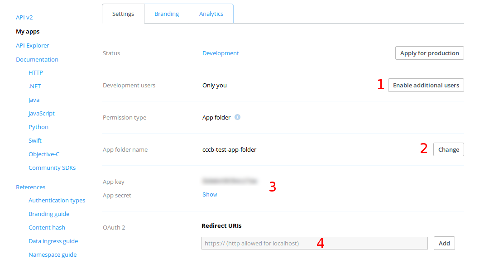
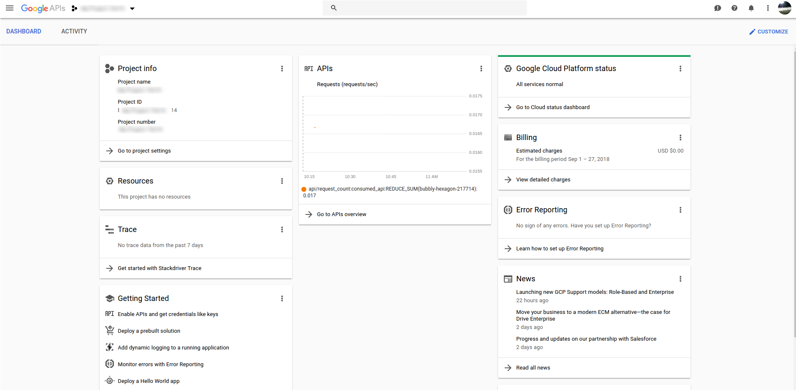
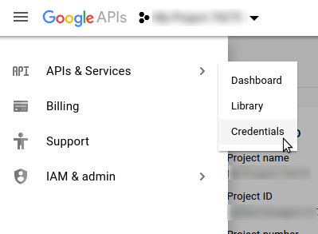
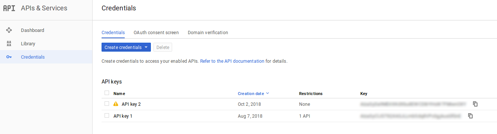

## CNAP Setup

---
###Contents
[Getting started with GCP](#gcp)
[Configuring the main host](#main-host)
[Starting CNAP](#starting-app)
[Cromwell server setup](#cromwell-setup)
[Appendix A- Registering with storage providers](#appendixA)
[Appendix B- Gmail integration](#email)
[Appendix C- Additional notes and remarks](#additional-notes)


### Getting the VMs started

<a id="gcp"></a>
**Google Cloud Platform**
Starting from a new Google Cloud Platform account, create a billing account and a new project to use for the CNAP and associated resources.  Creation of a separate project allows all costs to be isolated from other cloud resources you may use.

For the standard setup, you will need to create two instances.  One is the server that will run the main application and the other will host the Cromwell server.  It is also possible to both servers from the same host, but we will not cover that here.

For the application server, only a modest machine is needed.  On GCP, we chose a `n1-standard-1` instance running Debian (stretch), with 100GB persistent disk. We allow full access to all cloud APIs, and enable http/https traffic.

Once the machine is running, navigate to VPC Network -> external IP addresses.  There you will see the ephemeral external IP that was assigned to the main host machine.  In the dropdown, you can change that to "static", at which point it will ask you to name that static IP.  Pick something memorable so you can easily tell this as the IP which points at your "main" application.  

Similarly, we start a VM that will host the Cromwell server, although we did not reserve a static IP for this instance.  You may of course reserve a static IP, but the ephemeral IP will not change unless the machine is restarted.  We still allow full access to all cloud APIs but we do *NOT* enable http/https traffic (which is enabled by default).  The size of the persistent disk was chosen to be smaller here (30Gb), although Cromwell creates significantly large logs by default.  Note that the Cromwell development team recommends a modest amount of RAM (e.g. > 6Gb), so choose the machine specification accordingly.  

**Securing Cromwell**
For security reasons, we chose to prevent public access to the Cromwell server; above, we deselected the options for allowing inbound http/https traffic.  To allow the main application to submit jobs to our Cromwell server, we must allow communication between the two VMs.  There are multiple ways to accomplish this, but we chose to create a specific firewall rule.

The steps for creating firewall rules may be change with time, but at the time of this writing, we used the following steps:
- Navigate to VPC Network --> Firewall rules in the GCP console.  
- Click "Create firewall rule" at the top
- Fill out form
  - Give a memorable name to identify this firewall rule
  - Ensure "Direction of traffic" is "ingress"
  - Ensure "Action on match" is "allow"
  - Ensure "Targets" dropdown is set to "Specified target tags"
  - Type an identifer in the "Target tags" field.  I chose "cromwell-8000".  This is simply a tag that you will later "add" to the Cromwell host VM.
  - Ensure "Source filter" is set to "IP ranges"
  - In "Source IP ranges", use the static IP address assigned to the *main application* VM.
  - Under "Specified protocols and ports", select "tcp" and add "8000" since that is the default port that Cromwell starts under.  If you choose a different port for Cromwell (via the Cromwell config file), then obviously change that accordingly.
- Click "create"

Following creation of the firewall rule, go back to the compute engine section and open the configuration page for the Cromwell host VM.  At the time of writing, changing network configurations requires you to stop the VM temporarily, so do that if it is currently running.  Select "edit" and under the "network tags" add the "target tag" you created earlier (e.g. "cromwell-8000") by typing into the text field.  That applies the firewall rule to this VM.  Save and start the machine again.

**AWS**
Not implemented at this time.

---

#### Acquire domain name

The storage providers (Dropbox, Google Drive), require domain names to perform authentication, and will generally not work with raw IP addresses.  Thus, acquire a domain and map it to the main application server at the static IP from earlier.  Testing has not been performed using localhost, although some providers will indeed allow that. 

---
<a id="main-host"></a>
#### Setting up the main server

The application runs inside a Docker container, so minimal configuration is needed for the application server itself.  In short, we need a public-facing webserver (nginx here) and the ability to run Docker containers.  

SSH into the main application server (see instructions for your cloud provider) and first install the nginx webserver and dependencies for Docker:

```
sudo -s
apt-get update
apt-get install -y \
    nginx \
    apt-transport-https \
    ca-certificates \
    curl \
    gnupg2 \
    software-properties-common \
    git
```
Note that we also install `git`.  We do this in case one would like to build a fresh Docker image using the latest repository.  If the container is being pulled from Dockerhub, then `git` is not strictly necessary.

To complete the Docker installation:
```
curl -fsSL https://download.docker.com/linux/debian/gpg | sudo apt-key add -
add-apt-repository \
   "deb [arch=amd64] https://download.docker.com/linux/debian \
   $(lsb_release -cs) \
   stable"
apt-get update
apt-get install -y docker-ce
```

Ensure everything was installed correctly:
```
docker run hello-world
```

Note that these instructions may change over time.  Consult the Docker documentation for installation on your system as necessary.

**Enabling https and getting nginx up and running**
We advise the use of only https for CNAP; storage providers such as Dropbox will require this for authentication callbacks.  You can use any certificate authority you like, but we simply use the free SSL certificates provided by LetsEncrypt.  

Go to letsencrypt.org/ which ultimately sends us to https://certbot.eff.org/

For Debian (Stretch), it asks us to install certbot:
```
apt-get install -y python-certbot-nginx -t stretch-backports
```

Stop nginx (perhaps not strictly necessary):
```
service nginx stop
```

Add a basic nginx config file at `/etc/nginx/sites-enabled/cnap.conf` with the following content:
```
server {
    listen 80 ;
    listen [::]:80 ;
    server_name <YOUR DOMAIN>;
}
```
Change the domain above (`<YOUR DOMAIN>`) as appropriate.  

Now run (as root):
```
certbot --nginx
```

This will prompt some basic questions and ask if you would like to active https for your domain.  Following this, it will ask if you want certbot to edit your configuration to create a http to https redirect.  Choose that option.    

To double-check, open the nginx conf at `/etc/nginx/sites-enabled/cnap.conf` and it should look something like:
```
server {
    server_name <YOUR DOMAIN>;

    listen [::]:443 ssl ipv6only=on; # managed by Certbot
    listen 443 ssl; # managed by Certbot
    ssl_certificate /etc/letsencrypt/live/<YOUR DOMAIN>/fullchain.pem; # managed by Certbot
    ssl_certificate_key /etc/letsencrypt/live/<YOUR DOMAIN>/privkey.pem; # managed by Certbot
    include /etc/letsencrypt/options-ssl-nginx.conf; # managed by Certbot
    ssl_dhparam /etc/letsencrypt/ssl-dhparams.pem; # managed by Certbot
}

server {
    if ($host = <YOUR DOMAIN>) {
        return 301 https://$host$request_uri;
    } # managed by Certbot

    listen 80 ;
    listen [::]:80 ;
    server_name <YOUR DOMAIN>;
    return 404; # managed by Certbot
}
```

Note that we will be using nginx to direct requests to our Gunicorn application server, which will reside in the application Docker container.  The host machine and Docker container communicate via a unix socket placed in a directory that is accessible by both the host machine *and* the Docker container.  Below we choose to place it in a new directory (`mkdir /www`), which you can change to your preference.  We then add the following snippet inside the first server block above:
```
    location /static/ {
        root /www;
    }

    location / {
        include proxy_params;
        proxy_set_header X-Forwarded-Proto https;
        proxy_pass http://unix:/www/cnap.sock;
    }
```

Note that static files (Javascript, CSS, images) are served by nginx and not by the application server (gunicorn).  Thus, any static files need to be copied to a location accessible by both the host machine and the Docker container. (which is `/www` here).   When CNAP ingests new WDL-based workflows, it performs the appropriate copy of static files so that they are placed in the correct location.  For more information, see the section on static files below.

Save the nginx conf file, test the syntax with `service nginx configtest`,  and start nginx again:
```
service nginx start
```
If you encounter any errors about "Address already in use", run `netstat -tulpn` and see which process is using ports 80 and or 443.  Then kill them with `kill -2 <PID>`.  Try starting again.  Check the status with `service nginx status`.
 
If you now visit the site in your browser, you should get a 502 bad gateway error, which is expected since the application server is not yet active.  Everything is setup on the host, but the application container is not yet running.

---
<a id="starting-app"></a>
#### Starting the application

There are two ways to acquire the application:
- Pull a CNAP Docker image from Dockerhub 
- Clone the repository and build your own image locally


**Building your own image**
Since the first method is very straightforward, we show the second case, for situations where customization is desired.  Note that this requires `git` to be installed on your host VM.

```
cd /www
git clone <REPOSITORY URL>
cd cnap/docker_build
docker build --no-cache -t <IMAGE NAME> .
```
Although unnecessary for the first time building, we use the `--no-cache` flag so that we pull a fresh copy of the remote git repository to build into the Docker image.  If this flag is left out, Docker will not register any change since the `RUN` command did not change; hence, the layer could be stale and not the most up-to-date release.

**Start the container**
Once the image is pulled or your custom build finishes, we start the container interactively with:
```
docker run -it -v /www:/host_mount <IMAGE NAME>
```
Note that the `/www` directory (where we will allow nginx and gunicorn to communicate via a unix socket) is mounted to the container.  The location of the mounted directory *inside* the container is `/host_mount`.  If `/host_mount` is changed, then changes must be made to the startup script `startup_commands.sh` (located at `/opt/startup/startup_commands.sh` in the container).  If there is no good reason to change it, probably do not :).

The first step once inside the container is to setup your database.  Without the database, we cannot do the initial startup of the application.  Here we use MySQL, but any Django-compatible database can work, including the development SQLIte3 database. 

Start the mysql daemon and prepare the install:
```
service mysql start
mysql_secure_installation
```
In the installation script we create a root password and answer "Y" for all the other questions.  We then create a mysql session to create the database:
```
mysql -u root -p
```
Enter your root password and then execute the following SQL statements:
```
> create user '<DB_USER>'@'localhost' identified by '<DB_PWD>';
> create database <DB_NAME> CHARACTER SET UTF8 DEFAULT COLLATE utf8_general_ci;
> grant all privileges on <DB_NAME>.* to <DB_USER>@localhost;
> flush privileges;
```
(If you want this user to also be able to create new databases, for example when running unit tests, make the third line above `grant all privileges on *.* to <DB_USER>@localhost`)


Now that the database is ready (but without any table schema), we have to provide those database details to Django.  This way, when the startup script runs, Django is able to connect to the database and create the schema and tables  Open the Django settings template file (`cnap/settings.template.py`) and edit the `DATABASES` variable:
```
DATABASES = {
    'default': {
        'ENGINE': 'django.db.backends.mysql',
        'NAME': '<DB_NAME>',
        'USER': '<DB_USER>',
        'PASSWORD': '<DB_PWD>',
        'HOST': 'localhost',
        'PORT': '3306',
    }
}
```
(Note that above we create the database with the utf8 specification.  When attempting to run Django tests with `python3 manage.py test` there were issues with the default settings and it was raising problems like
```
django.db.utils.OperationalError: (1071, 'Specified key was too long; max key length is 767 bytes')
```

To fix this, edit `nano /etc/mysql/mariadb.conf.d/50-server.cnf` and change the lines
```
character-set-server  = utf8mb4
collation-server      = utf8mb4_general_ci
```
to be just utf8 (not utf8mb4)
)

Now that Django is able to communicate with a database, we are technically able to start the server.  However, we first require various identifiers and keys to be entered in the appropriate places.  Since CNAP requires a number of external providers which require application keys/secrets, we include the startup script (`/opt/startup/startup_commands.sh`) to guide users in filling out configuration parameters.  Of course the parameters can be edited after the fact, if desired.

Note that prior to launching the startup script, you should decide which client storage providers (e.g. Dropbox, Google Drive) you will be using.  You must choose *at least* one.  Instructions for obtaining the necessary credentials are included in Appendix A.

Run the startup script:
```
/opt/startup/startup_commands.sh <socket>
```
where `<socket>` is a string which will determine the name of the unix socket communicating between the application container and the main VM.  For instance if `<socket>` is `production`, then this will create a socket at `/host_mount/production.sock`.  Remember earlier that we set the name of the expected socket in the nginx configuration file, since nginx needs to know where to route the CNAP requests.  If that was given as
```
...
        proxy_pass http://unix:/www/cnap.sock;
...
```
then the correct command would be `/opt/startup/startup_commands.sh cnap` for CNAP to startup properly.

Answer the questions as prompted.  Some notes on the questions:
- You must choose at least one cloud-based storage provider (Dropbox, Google Drive, others).  Otherwise it will exit.
- For transfers, we spawn "worker" machines that perform the transfers in parallel.  These need to communicate back to the main application to signal that they have completed.  To verify the identity of those requests to the main application, we use a key exchange.  To that end, some of the prompts will ask you to input random character strings that are multiples of 8 characters.
- One of the prompts will ask you to enter the name of a bucket.  This bucket will be the "root" of all files associated with CNAP.  While it is not strictly necessary (as transfers will create buckets as necessary to perform their work), **you should create this bucket beforehand**-- this way you know the bucket name is available (as they are required to be globally unique) and will remain as such.  Note that the setup script does not check the validity of the name, existence of the bucket, etc.  It merely substitutes the name of the bucket into the proper variables.

If you experience a problem with this startup script (or make an error and exit), it is possible that subsequent re-runs will give errors related to processes that are controlled by the supervisor process manager.  If that is the case, you can query if there are any active processes being managed by supervisor with `supervisorctl status`.  If there are indeed active processes, you can stop with `supervisorctl stop all`, and remove them individually with `supervisorctl remove <name>` (there is no command to remove all at once).  Following that, you likely need to stop the supervisord process itself by finding its PID (`ps -ef | grep supervisord`) followed by `kill -9 <PID>`.

As part of this process, you will be asked to create a superuser, which has full admin privileges in the Django framework.  Make sure you remember the email/password associated with this superuser (more superusers can be created later if necessary, however).

If all goes well, you should be able to navigate to your domain and view the application.

As you might have noticed during the script, there was a prompt for optional Gmail integration.  To prevent abuse, Google Cloud blocks traffic on standard mail ports, so we use Gmail to send notification emails to CNAP users.  If you selected "yes" to the prompt, then you need to create a proper credentials file to authenticate with the Gmail API.  See the [section below](#email) which covers this in detail.


---
<a id="cromwell-setup"></a>
### Cromwell host machine setup

This section covers the setup of a second machine which will act as the Cromwell server.  This server is responsible for handling job submissions from CNAP and performing all the orchestration of cloud-based resources (e.g. starting VMs, pulling data from storage buckets).

SSH into the Cromwell server that was created earlier.  Recall that we added a special firewall rule to allow **only** inbound requests from the main application host.  However, at this point, the machine itself is simply a basic Debian distribution with nothing changed.  We first install the Java runtime environment, which we need to run Cromwell:
```
$ sudo -s
$ apt-get update
$ apt-get install -y default-jre
```
Verify that Java was installed:
```
$ java -version
openjdk version "1.8.0_181"
OpenJDK Runtime Environment (build 1.8.0_181-8u181-b13-2~deb9u1-b13)
OpenJDK 64-Bit Server VM (build 25.181-b13, mixed mode)
```

We also need Docker to be installed-- for ease of installation, we simply use a MySQL Docker container.  Of course you may wish to install MySQL directly on your Cromwell server, but that is not covered here.  We follow the instructions for installing Docker and then run:
```
docker run -p 3306:3306 --name mysql_container \
    -e MYSQL_ROOT_PASSWORD=cromwellroot \
    -e MYSQL_DATABASE=cnap_cromwell \
    -e MYSQL_USER=cromwelluser \
    -e MYSQL_PASSWORD=cromwelluserpwd \ 
    -d mysql/mysql-server:5.5
````
Note that the `latest` image version ended up causing problems with Cromwell, so we used 5.5.  Also be sure to change the various usernames/passwords above.  


Now get the latest Cromwell JAR.  At the time of writing this was v36 and was located at the Broad Institute's Github (https://github.com/broadinstitute/cromwell/releases).  We keep the JAR under a new directory, `/opt/cromwell/`.

```
$ mkdir /opt/cromwell
$ wget https://github.com/broadinstitute/cromwell/releases/download/36/cromwell-36.jar -P /opt/cromwell/
```
Since we would like Cromwell to remain alive (and recover from failures), we place it under control of supervisor, which we need to install

```
$ apt-get install -y supervisor
```

We will also create a non-root user to run execute Cromwell:
```
$ adduser cromwell-runner
```

In addition, we need to create a folder for Cromwell to write logs.  By default it tries to write to `/cromwell-workflow-logs`.  so we must create a folder there and give ownership of that folder to the `cromwell-runner` user.  As root (which you should be):
```
$ mkdir /cromwell-workflow-logs
$ chown cromwell-runner:cromwell-runner /cromwell-workflow-logs
```

Create a conf file for supervisor at `/etc/supervisor/conf.d/cromwell.conf`: 

```
[program:cromwell_server]
command=/usr/bin/java -D<JAVA PROPERTIES> -jar /opt/cromwell/cromwell-36.jar server
user=cromwell-runner

; Put process stdout output in this file
stdout_logfile=/var/log/cromwell/stdout.log

; Put process stderr output in this file
stderr_logfile=/var/log/cromwell/stderr.log

autostart=true
autorestart=true
stopsignal=QUIT
```

Note the template/dummy `-D<JAVA PROPERTIES` flag at the start of the `command` parameter.  This provides arguments to the Java runtime environment (JRE).  This flag is not strictly required (and should be removed if no arguments are passed), but when running on GCP, we use the `-D` flag to pass the path to a configuration file. That file dictates how Cromwell is to be run when using GCP (e.g. which availability zones, etc.).  Details for specific cloud environments are given below.

Prior to starting supervisor, the log directory needs to be created:
```
$ mkdir /var/log/cromwell
```

Then start supervisor:
```
$ supervisord
$ supervisorctl reread
$ supervisorctl update
```
Running `supervisorctl status` should show the `cromwell_server` process as `RUNNING` if all is well.  To test that the Cromwell server is up, you can check the log at `/var/log/cromwell/stdout.log`.  

To test that Cromwell is able to respond to your requests, you can log into the main application VM and initiate a request to one of the Cromwell API endpoints.  For instance, you can query the job status endpoint (here using a random, but valid UUID):

```
 $ curl -X GET http://<CROMWELL SERVER IP>:8000/api/workflows/v1/e442e52a-9de1-47f0-8b4f-e6e565008cf1/status
 ```
If the server is running, it will return a 404 (with the JSON below) since the random UUID will not be a job identifier that Cromwell is aware of:
 ```
{
  "status": "fail",
  "message": "Unrecognized workflow ID: e442e52a-9de1-47f0-8b4f-e6e565008cf1"
}
```

If you try this same request from a different machine (e.g. your local machine), the request should timeout if the firewall rule was applied correctly.

**GCP configuration**

As described above, for Cromwell to have access to GCP resources (e.g. to start VMs and access bucket storage), it needs to be started with a configuration file specific to GCP.  A template is provided in `<repository_director>/etc/google.conf`.  Project-specific variables are encased in angle brackets "<", ">", and need to be completed before using with the Cromwell JAR.  Specifically, you need to fill-in the google project ID (the name, *not* the numeric project ID), and the location of an *existing* storage bucket where Cromwell will execute the workflows.  Once complete, save this file somewhere on the VM that will host the Cromwell server; below we chose to locate it at `/opt/cromwell/google.conf`.  The `command` in the supervisor config file above should then read:
```
...
command=/usr/bin/java -Dconfig.file=/opt/cromwell/google.conf -jar /opt/cromwell/cromwell-36.jar server
...
```

**AWS configuration**
At the time of writing, AWS was working on Cromwell integration, but it was not as mature as the GCP implementation.

---
### Platform-specific items

#### GCP
When running on GCP, Cromwell uses the Google Genomics API, which must be enabled.  Head to the "APIs and Services" console section and enable it.

---

### Appendix A:

<a id="appendixA"></a>
#### Register with storage providers


Instructions for these can potentially change over time, but in general each storage provider will require you to register as an application developer.  Instructions for Dropbox and Google Drive are provided below.

You need to choose at least one storage provider for the application to run.  In addition, we provide URLs to live-test both authentication and transfer functionality.  These will help to test that the proper credentials are in place for each provider.

**Dropbox**

You can register a new application with Dropbox at https://dropbox.com/developers/ .  There, you create an application by:

- Click on "My Apps" (left-hand menu)
- Click "Create app"
- Choose "Dropbox API"
- Choose "App folder", which gives the transfer application access to a single folder in a user's Dropbox.
- Create any name for your application.

After this, Dropbox will send you to a dashboard for your application, as shown below.  You may click on "Enable additional users" (1) to allow "public" access to the application.  You can change the name of the accessible folder in (2), and you need to add your callback URLs in (4).  

For dropbox, the callback URL in the source code is formatted like `https://<YOUR DOMAIN>/dropbox/callback/`, so you will substitute your domain and enter that value in the redirect URIs field (4).  For live-testing purposes, you will need to register two additional URLs, if you wish to use the live-test functionality.  These are:
- `https://<YOUR DOMAIN>/test/dropbox-callback/` (for testing OAuth2 token exchange)
- `https://<YOUR DOMAIN>/test/transfer-test/dropbox-callback/` (for performing an actual transfer)

Finally, you will need to keep track of your app key/secret pair.  When you start the Docker container that holds the application, a script will prompt you to enter these values, which will be placed into a configuration file.  



At the time of writing, application is placed in default "development" status.  This allows up to 500 unique users to connect to your application.  If you expect use beyond that, we encourage you to apply for production status, which typically involves creation of a test account so the Dropbox team can evaluate the application.


**Google Drive**

 To integrate with Google Drive, you need to obtain **two** types of  application credentials from Google.  One is for the OAuth2 authentication flow (allowing uploads to Google Drive) and the other is an API key used to identify your application when using Google's Picker API (which lets you use Google's own file browser for selecting files to transfer TO your application's bucket storage).
 
   Go to `https://console.developers.google.com` (or `https://console.cloud.google.com` if you are using Google Cloud as your cloud provider).
 
 If you are not using Google Cloud as your host (in which case you are likely already using `https://console.cloud.google.com`), this will require you to create a new "project" with google, at which point it will direct you to the developers dashboard, as pictured below:



 Using the menu on the top left, navigate to "APIs & Services" as shown below.

 First, you will need to enable access to both the Google Drive and Google Picker APIs, which you do via the "API & Services --> Dashboard" page.  Search for "Drive" and "Picker" and approve activation of each API. 


   
 
 Following that, you will need to create OAuth credentials for your application.  We note that the ability to read/write to a user's Google Drive requires an application review by Google.  Typically, an attempt to create new OAuth credentials with the read/write "scope" will result in Google asking you to fill-in the "OAuth consent" screen.  Since it is challenging to anticipate changes in procedure and steps, we advise searching for some phrase like, "obtain OAuth credentials Google Drive API".  

 Once the application is approved, the OAuth2 credentials you obtain should be for a web application, which will require you to register the callbacks, similar to Dropbox above.  The Google Drive callback is:
 - `https://<YOUR DOMAIN>/transfers/drive/callback/`
 
 and for live-testing:
 - `https://<YOUR DOMAIN>/transfers/test/drive-callback/` (for testing OAuth2 token exchange)
 - `https://<YOUR DOMAIN>/transfers/test/transfer-test/drive-callback/` (for live-testing an actual transfer)

 Note that you should also add your domain to the list of "Authorized JavaScript origins".

 With these steps successfully completed, you will need to obtain the ID (typically `<random characters>.apps.googleusercontent.com`) and secret for the credentials.  You will eventually enter those at the prompt when starting the application container.
 
 For the second set of credentials (the API key), go to the "APIs & Servies" tab and click on "Create credentials", choosing "API key" this time (see fiigure below).  After these credentials are created, simply copy down the random string somewhere, for use when starting the application.  This string will be publicly available, so it is *not* a secret. 



---
<a id="email"></a>
### Appendix B: Email functionality and Gmail integration

As part of the prompts during container startup, we ask if you would like to enable email notifications.  This allows users to reset their own passwords if they forget, and also informs them of CNAP activity like completed analyses or file transfers.  Enabling email is **not** necessary, but would preclude such features.

If you wish to use the Gmail API to send your emails, we provide details below.  

**Other email providers**
If you plan to use a *different* email service, you will need to edit the application code accordingly.  The code responsible for sending email is contained in `<repository directory>/helpers/email_utils.py`.  If you keep the function signature the same, other parts of the application will be able to use your custom function with no further edits.

Note that to prevent abuse, Google blocks outgoing requests to typical mail server ports.  Hence, it is not straightforward (if even possible) to work with an existing mail SMTP server.  Google provides alternative suggestions using various third-party services like SendGrid.

**Gmail**
If you wish to use Gmail as your mail provider, the CNAP application is "ready" once you have performed an OAuth authentication key exchange between Google and your container.

Choose a Gmail account (or create one anew) from which you wish to send email notifications.  On your own machine (not in the application container!), go to the Google developers console (`https://console.developers.google.com` or `https://console.cloud.google.com`) and head to "APIs & Services" and "Dashboard".  Click on "Enable APIs and Services", search for "Gmail", and enable the Gmail API. 

Once that is enabled, go to the "Credentials" section under "APIs and Services".  Just as above, we will create a set of OAuth credentials.  Click on the "Create credentials" button and choose "OAuth Client ID".   Choose "Other" from the options and give these credentials a name.

Once the credentials are created, download the JSON-format file.  Open that file, copy the contents, and paste the text into a *new* file **in your container**  and save it somewhere memorable (e.g. `/www/credentials/original_gmail_credentials.json`).

Next, we provide a helper script, which walks you through exchanging these credentials and creating a "final" credentials file whose format is understood by the Google python SDK.  Simply run 
```
python3 helpers/exchange_google_email_credentials.py -i <original_creds_path> -o <final_creds_path>
```
This script will ask you to copy a link into your browser, which you can do on any machine.  That URL will ask you to log-in to the Gmail account you will be using for notifications.  Finally, if successfully authenticated, you will copy a "code" back into the terminal running in your container.  Once complete, the script will write a second JSON-format file at the location specified in the `-o` argument.

Finally, open `/www/cnap/settings.py` (in your container!) and edit the variable `EMAIL_CREDENTIALS_FILE` to be that path (as a string).  For example, if you ran 
```
python3 helpers/exchange_google_email_credentials.py \
    -i /www/credentials/orig.json \
    -o /www/credentials/final_gmail_creds.json
```
then you would edit `cnap/settings.py` to be:
```
...
EMAIL_CREDENTIALS_FILE = '/www/credentials/final_gmail_creds.json'
...
```
Provided that `EMAIL_ENABLED=True`, Gmail integration is complete.

Note that you need to restart gunicorn for any changes in the `settings.py` file to take effect.  Thus, you should now run `supervisorctl restart gunicorn` or else anything using email functionality will fail.

<a id="additional-notes"></a>
### Appendix C: Additional notes and remarks:
**Storage hierarchy**

All user files are held under the "root" bucket which was input as part of the setup prompts.  In that section, we indicated that the bucket should ideally be created *prior* to the application starts, so that one can ensure the bucket is not claimed by someone else in the interim (bucket names must be globally unique).

User files are kept in "folders" underneath that root, identified by their user UUID.  Thus, one can find a user's files under (here for Google storage) `gs://<root bucket name>/<user UUID>/`.  Furthermore, output files from an analysis (identified by another UUID) would be stored in `gs://<root bucket name>/<user UUID>/<analysis UUID>/`.

Uploads are placed in a special uploads folder, e.g. `gs://<root bucket name>/<user UUID>/uploads/`

**Docker containers**

Note that for the transfer process, we launch container-optimized VMs that in turn start containers automatically.  These are provider (e.g. Dropbox) and environment (e.g. GCP) specific, and are located under `<repository>/transfer_app/docker_containers/`.  For example, the Dockerfile for an upfrom *from* Dropbox to our GCP storage is located in `<repository>/transfer_app/docker_containers/google/uploads/dropbox/`. 

If you make any changes to the containers, ensure that you rebuild and commit the container to a container registry/repository.  The remote location of the containers is referenced in the configuration files.  For example, the container that performs an upload *from* Dropbox *to* Google has a configuration variable `docker_image` located in `config/uploads.cfg` in the `[dropbox_in_google]` section.  Similar for downloads.


**Asynchronous code**

Note that we use supervisor to manage processes such as redis and celery, which enable the asynchronous features of the web application.  If you make changes to any source code that will run asynchronously, you need to stop/restart those processes to "register" your changes.  Otherwise, any changes will be ignored.

You can stop those processes and restart by running:
```
supervisorctl stop all
supervisorctl remove cnap_celery_beat
supervisorctl remove cnap_celery_worker
supervisorctl remove redis
supervisorctl reread
supervisorctl update
```

**API tokens**

You can make requests to the API directly (e.g. using `cURL`) if the user has a token generated.  This is helpful in situations where an administrator might want to add a large amount of files which may already exist in a storage bucket.  Such a use-case might arise if sequencing files are already stored on your bucket storage system.  In this case, the administrator may wish to associate those files with a particular client, who might then use the CNAP to perform analysis.  

To generate a new key, the admin can do this directly in the Django admin (`https://<YOUR DOMAIN>/admin/`) in the "Auth token" section.  Simply choose the user, copy the token, and send that to the client.  Alternatively, a request may be made to the token endpoint at `https://<YOUR DOMAIN>/api-token-auth/` with the user's credentials:

```
curl -X POST \
  -d '{"username":"<USERNAME/EMAIL>, "password":"<PASSWORD>"}' \
  -H "Content-Type:application/json" \
  https://<YOUR DOMAIN>/api-token-auth/
```
This will return a token in a json object, such as:
```
{
    "token": "<YOUR TOKEN>"
}
```
then, to make requests (e.g. query for resources here), add the token as a header:
```
curl -H "Authorization: Token <YOUR TOKEN>" https://<YOUR DOMAIN>/resources/"
```
