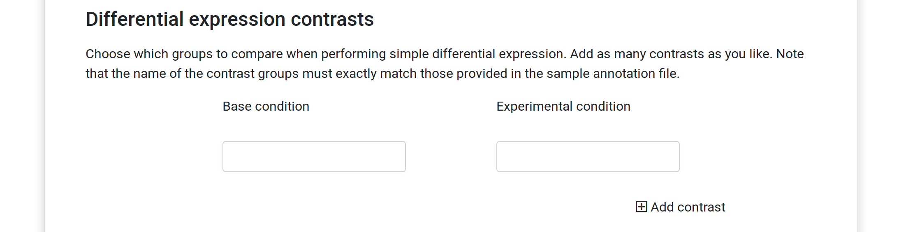

#CNAP Guide: Creating and adding new WDL-based workflows

The CNAP is designed to ingest WDL-based workflows which run on the Cromwell execution engine.  This guide assists in the creation and ingestion of workflows, including the specification of the custom UI elements that accompany each workflow.  For a simple, but complete implementation (a "Hello World!" please see the guide for that).  This guide provides more detail and explanations.

In this document there are three primary "roles" described-- the CNAP admin, the developer, and the client.  We attempt to reference to these roles in a consistent manner below.  
- The **admin** has superuser privileges, including logging into the application server, running the application Docker container, etc.  They can essentially do anything.
- A **developer** is someone who might write a WDL-based workflow that performs some analysis.  They *could* have admin privileges, but might not.  For instance, the CNAP admins might work with an academic group who has developed an analysis workflow they would like to "publish" using CNAP.  Rather than learning how to work with the platform, they might just simply create a WDL script and send that to the CNAP admin.
- A **client** is the end-user of the application.  Typically this would be someone who has no particular knowledge of bioinformatics and/or programming.  This might be a bench-scientist running a simple differential gene expression.  They have accounts on the CNAP and are able to execute analyses through the web-based interfaces provided by the CNAP.

Throughout this document, we assume familiarity with WDL-based workflows, git, and Docker.

## Contents:

[Quickstart](#quickstart)

[Getting started](#before-starting)

[Creating new workflows](#create-new-workflows)

[Specifying the GUI](#specify-gui)

[The GUI schema](#gui-schema)

[Mapping the GUI to the WDL](#backend-mapping)

[(Advanced) Creating custom GUI elements](#creating-new-elements)

[Viewing the final GUI](#final-view)

[Applying constraints to workflows](#constraints)

<a id="quickstart"></a>
## Quickstart
The following quickstart will serve as a high-level overview for integrating new workflows.  More details are available in the following sections, and these steps only present the bare minimum of information about any particular step.


The steps below assume you have admin level access, as you need to be able to connect to CNAP pages that are accessible only by admins.  It also assumes you have a functional WDL-based workflow (WDL file(s) and JSON inputs) that is able to run an analysis independent of CNAP.  The Docker image(s) in which your analyses run need to be pushed to Dockerhub.  

1. Create any [necessary "companion" files](#required-files) for your WDL.  This is in addition to the WDL, WDL-input, and includes, at minimum, the `gui.json` file which defines the user interface.
1. Create a git repository and push the WDL and associated files to a public-accessible git host (e.g. github.com)
1. Ensure that the Docker images responsible for executing the WDL tasks are pushed and available to be pulled from Dockerhub
1. Navigate to `https://<DOMAIN>/dashboard/` and choose the link for creation of a new workflow.
1. Copy/paste the repository URL (e.g. https://github.com/qbrc-cnap/paired-read-gatk-haplotypecaller-and-vep.git) into the text box and click the button.


If everything is OK with your setup, the workflow should be integrated and you are able to create new analysis projects based off the WDL.  For addressing potential errors, see [debugging](#errors).
 
For a basic, but concrete implementation of a workflow, please see the ["hello, world!" CNAP workflow](cnap_hello_world.md)

<a id="before-starting"></a>
#### Before starting-- about your WDL-based workflow
Before attempting to integrate any WDL-based workflows into CNAP, the developer should ensure that the workflow is stable and robust.  CNAP provides the ability to wrap workflows with a simple GUI (and provides file transfer utilities) so that analyses can be made accessible and distributable through a web-based platform.  CNAP is not responsible for debugging WDL.  Thus, at the point of integrating with CNAP, your workflow should ideally be "production-ready".  This includes graceful error handling, unit tests, etc.  You may, of course, integrate WDL-based workflows that are still in development, but the debugging process is less direct when routing the WDL job submissions through CNAP.

Given the working WDL file(s), we impose a couple of additional "requirements" which need to be added if they are not already present.

1. Each defined WDL task must include a runtime section that includes a `docker` key.  We require that all WDL tasks are executed in properly versioned Docker containers.  In cloud-based environments like Google Cloud Project, specifying a `runtime` section is already required, but we strictly enforce it for CNAP.  The Docker images must be specifically tagged-- the default `latest` tag is not allowed.  This enforces that specific versions of all workflow components are unambiguous.
<a id="meta"></a>
1. A `meta` section inside the main workflow directive.  This is not strictly enforced, but aids with the organization and display of workflows within CNAP.  There are three keys we look for:
    ```
    meta {
        workflow_title : "Exome tumor-normal analysis"
        workflow_short_description : "For exomes variant analysis"
        workflow_long_description : "Use this workflow for analyzing matched tumor normal pairs that were sequenced using whole-exome sequencing technology.  The analysis starts from fastq-format input files and creates a VCF file of high-quality variants at the end"
    }
    ```
    These fields provide more detail about the analysis, which can help both admins and users with selections.  If they are not specified, they are left empty.


<a id="create-new-workflows"></a>
## Ingesting a new workflow

As briefly mentioned above, new workflows are ingested by navigating to `https://<YOUR DOMAIN>/dashboard/` and providing a link to a github repository.  This workflow ingestion mechanism ensures that workflows are properly source-controlled and thus reproducible.  

Prior to attempting ingestion, it is important that you do your best to have a stable WDL and that the additional required files are as close to "bug-free" as possible.

**Required files:**
<a id="required-files"></a>
At minimum, your repository needs three files with the following names:

- `main.wdl`: Your "main" WDL file.  This is the typical "entry" WDL file.  Must contain a `workflow` directive, and ideally contains a `meta` section as [described above](#meta).  Additional WDL-format files can be included, but there must be a `main.wdl`.
- `inputs.template.json`: The "inputs" JSON file for the workflow.  Optional inputs should be removed.  See [here](#inputs) for more details
- `gui.json`: A JSON-format file which dictates how to construct the HTML GUI.  [See below](#specify-gui).
- `docker/Dockerfile`: a Dockerfile, contained in a folder named `docker`.  Additional files that are packaged into the Docker container should also go into that `docker` directory, although CNAP ignores them.  This is a convention to assure that all workflow-related files are contained in a single repository.

**Docker considerations:**
We require that each task contains a `runtime` stanza that specifies the Docker image to use when executing that task, such as

```
task X {
    ...
    runtime {
        ...
        docker: "docker.io/foo/bar:v0.1"
        ...
    }
}
```
When operating in cloud environments, the Cromwell engine also requires this `docker` key, but we further require that the Docker image is tagged (`v0.1` here) to avoid ambiguity with the default `latest` tag.  The Docker images must be pushed to Dockerhub and be "public".  During the ingestion process, CNAP queries Dockerhub to ensure that the specified Docker images exist in their repository.  Failure to find an appropriate image will cause the ingestion process to fail. 

**The inputs JSON file**
<a id="inputs"></a>
As part of most WDL-based workflows, there will be an "inputs" JSON file, which defines the various arguments to the WDL process.  Ultimately, CNAP will inject values for the input variables into a "templated" version of this inputs JSON file.  We require that it be named `inputs.template.json`.  The easiest way to create an inputs JSON file is to run Broad's WOMTool JAR:

```
java -jar /path/to/womtool.jar inputs main.wdl
```

Depending on the WDL, certain inputs may effectively be optional, such as those set to a specific value (e.g. `Int kmer_length=22`).  When WOMTool processes a WDL that includes optional arguments, it will specifically mark those inputs as optional.  **Those should be removed from your `inputs.template.json` prior to ingestion.**

The optional inputs cover situations where a developer might include inputs to the WDL that *can* change, but *should not* be arbitrarily customized, at least not without specialized knowledge.  An example might be setting a k-mer length (an integer) for an alignment algorithm.  When the WDL is constructed, the developer might desire to keep the k-mer length as a configurable parameter.  For a WDL that is executed by a team with appropriate bioinformatics experience, this might be a common situation.  However, when this WDL is integrated with the CNAP, it might be desired to fix that parameter to a "safe" default, appropriate for a first-pass analysis.  


**Additional files:**
In addition to the three required files, there may be *other* files included in the repository.  This can include additional WDL-format files for supporting cases where one might save WDL tasks in separate files, or cases where workflows execute sub-workflows (in the WDL/Cromwell nomenclature).  WDL-format files are identified by the `.wdl` suffix/file extension, so *only* files ending with that prefix will be used.  

There is no restriction on other types of files that may also be present in the repository.  In fact, there are often python scripts which support operations related to parsing inputs defined in the `gui.json` file.  We show concrete examples of this below.

Note that the `gui.json` file can be created by either the developer *or* the admin (or a combination of effort).  Since creation of a proper GUI might require some debugging/iterations to get correct, this task would likely fall more into the realm of the CNAP admin.  Additionally, the CNAP admin might be more familiar with creating the `gui.json` file whereas a developer's effort would be focused on a robust WDL workflow.


**Multiple workflow versions**
CNAP is able to manage multiple versions of the same workflow, as specifications evolve.  Multiple workflows with the same name (as determined by the `workflow` directive in your `main.wdl`) will be "versioned" so that there are no conflicts and older workflows may be recalled/re-run for reproducible analyses.

<a id="debug-workflow"></a>
**Debugging ingestion problems**
After clicking on the button to add the new workflow, the CNAP backend will attempt to process your request and create a new workflow.  This happens asynchronously, so other processes may slightly delay the ingestion process; typically the process completes within a few seconds.  If all is successful, the workflow will be added to the database.

In the situation where something has gone wrong due to a bug, CNAP will attempt to print a helpful error message to the database.  The url `https://<YOUR DOMAIN>/admin/analysis/pendingworkflow/` will display a table of your "pending" workflows and, in the case of errors, will typically have a large text string which might be helpful for debugging purposes.  Most often that string will be a Python stacktrace, so some familiarity with reading Python error traces is helpful.  If it is still not clear what went wrong, the next place to check would be the Celery log file at `/var/log/cnap/celery_worker.log`.  Examining the log file requires you to log into the Docker container serving CNAP, however.  If you are unable to understand the error or are unable to resolve it, please reach out to the CNAP team!


<a id="specify-gui"></a>
## Specifying the user interface (GUI)

A WDL workflow often has multiple inputs, such as files, strings, numbers, etc. which are specified with a JSON-format file.  When using WDL+Cromwell directly, a user would have to write this input file and submit it to the Cromwell server along with the WDL file(s) defining the analysis.  

With CNAP, developers create JSON-format files that construct basic user-interfaces which allow application users (clients) to easily specify those inputs through familiar web interfaces.  In this way, CNAP is able to distribute potentially complex and data-intensive analysis pipelines to non-technical users.

For example, a CNAP user might want to analyze raw fastq-format files to perform somatic variant calling, comparing matched tumor and normal samples.  The inputs to such a workflow could include the fastq files, the choice of reference genome, and the name of an output zip archive.  The GUI designed by the application developer could have three parts:
- a file selection element for choosing multiple fastq files
- a dropdown for choosing from several reference genomes
- a text box for naming the output file

Given the proposed GUI design above, the developer would construct the `gui.json` file to include these input elements, optionally specifying custom behavior as needed.  

Below, we show a basic `gui.json` which demonstrates the core set of GUI elements, and will cover the majority of use-cases.  We then discuss the GUI creation in more generality, including descriptions on how to write Python-based scripts which perform data tranformations behind-the-scenes.  We aim to provide concrete examples which cover a broad range of applications.

**Example walkthrough**

Here we demonstrate how to create the following GUI for a dummy exome analysis workflow:


We are creating a GUI for the following dummy WDL, which we show in part below; we only show the inputs since that is the only relevant part for constructing a GUI:

```
workflow ExomeWorkflow {
    
    Array[File] tumorSamples
    Array[File] normalSamples
    String outputFilename
    String genomeChoice

    ...<other WDL>...
}
```

The inputs JSON file would look like (as created by Broad's WOMTool):
```
{
  "ExomeWorkflow.genomeChoice": "String",
  "ExomeWorkflow.normalSamples": "Array[File]",
  "ExomeWorkflow.outputFilename": "String",
  "ExomeWorkflow.tumorSamples": "Array[File]"
}
```
Thus, we have four inputs: two arrays of files (tumor and normal FASTQ files), a string giving the name of an output file, and a string giving the choice of genome (via dropdown element).  This is NOT an actual workflow, so the inputs here are purely for illustration.

The following `gui.json` was used to create the GUI above. Below, we discuss each element, its attributes, and other important points.  
```
{
	"input_elements": [
		{
			"target": {
				"target_ids": ["ExomeWorkflow.normalSamples", "ExomeWorkflow.tumorSamples"],
				"name": "input_files",
				"handler": "input_mapping.py"
			},
			"display_element": {
				"type": "file_chooser",
				"regex_filter":".*fastq.gz",
				"label": "Input files:",
				"choose_multiple": true,
				"description": "Choose both tumor and normal samples for the analysis"
			}	
		},
		{
			"target": "ExomeWorkflow.outputFilename",
			"display_element": {
				"type": "text",
				"label": "Output filename:",
				"description": "Name the output file...",
				"placeholder": "Name the output file..."
			}	
		},
                {
			"target": "ExomeWorkflow.genomeChoice",
			"display_element": {
                            "type": "select",
                            "label": "Genome:",
                            "choices": [
                                {"value":"hg38", "display":"Human HG38"},
                                {"value":"m38","display":"Mouse GRCm38"}
                            ]
			}	
                }
	]
}

```

At the root of this JSON object, note that we only require a single key `"input_elements"` which points at a list of objects (here, 3 objects corresponding to the three input elements).  Each item in the list dictates an input element in the GUI (a file-chooser, a text box, and a dropdown, in that order).

Each input element object has two required keys: `"target"` and `"display_element"`.  The `"target"` key can point at either a string (see items 2 and 3) or a JSON object (see item 1), while the `"display_element"` always points at a JSON object.

Since it is the simplest element, we first examine the second element of the `input_elements` array, which corresponds to a text box in the GUI:
```
{
    "target": "ExomeWorkflow.outputFilename",
    "display_element": {
        "type": "text",
        "label": "Output filename:",
        "placeholder": "Name the output file..."
    }	
}
```
In this input element, the `"target"` attribute points at a string, which indicates there is a 1:1 mapping between the input GUI element and the input that will be submitted when we run the workflow.  As such, the value input to this text box will be directly "injected" into the `ExomeWorkflow.outputFilename` variable in the inputs JSON file.

The behavior/appearance of the actual GUI element is controlled by the object addressed by the `"display_element"` key.  Here we see that we would like a `"text"` input, which corresponds to a basic HTML text field input.  The `"label"` will label the text box, and the `"placeholder"` attribute fills in the help text.  

Note that our choice of `"type": "text"` was not arbitrary-- the value `"text"` corresponds to one of the pre-defined UI elements that are available in the [GUI schema](#gui-schema) we discuss later.  Furthermore, the selection of keys inside this display element object (e.g. "label", "placeholder") is determined by the input element type; each type of input element (text box, dropdown, etc.) has a set of available keys.  Some keys are required, while others provide default values.

Increasing in complexity, the next input element is the dropdown for selecting the reference genome, which we copy here:
```
{
    "target": "ExomeWorkflow.genomeChoice",
    "display_element": {
        "type": "select",
        "label": "Genome:",
        "choices": [
            {"value":"hg38", "display":"Human HG38"},
            {"value":"m38","display":"Mouse GRCm38"}
        ]
    }	
}
```
Once again, the `"target"` key points at a string (indicating 1:1 mapping), and we see that this corresponds to the `ExomeWorkflow.genomeChoice` input to the WDL workflow.  When a client selects "Human HG38" in the GUI, the CNAP backend will use inject "hg38" into the inputs.json file that is submitted to Cromwell.  

Note that the actual "data type" of `genomeChoice` in the WDL file is a "String" (similarly `ExomeWorkflow.genomeChoice` is specified to be a string in the inputs.json file).  However, we clearly want to allow only a small set of pre-defined choices, as we are choosing a genome, and a dropbox is the most sensible input element.  Therefore, in the `display_element` object we ask for a dropdown (`"type": "select"`), label it, and specify the choices available in this dropdown.

When we specify the options, we use the simple list of JSON objects as shown.  The use of "value" and "display" in those objects is not arbitrary, but is linked to the HTML template code that defines the dropdown.  If you are creating simple dropdowns in this same manner, then it is enough to just copy this and edit to your liking.  However, this dropdown example also provides a good example of how one might choose to define their own custom GUI elements, which we discuss in a later section.

The final element is the file chooser, which is itself a complete example of how to create a fully custom element that includes HTML, javascript, css, and custom "handler" code for the backend.  We "briefly" discuss here, but return to this in further detail below.  For reference, we copy here again:  

```
{
    "target": {
        "target_ids": ["ExomeWorkflow.normalSamples", "ExomeWorkflow.tumorSamples"],
        "name": "input_files",
        "handler": "input_mapping.py"
    },
    "display_element": {
        "type": "file_chooser",
        "regex_filter":".*fastq.gz",
        "label": "Input files:",
        "choose_multiple": true,
        "description": "Choose both tumor and normal samples for the analysis"
    }	
}
```

First, we note that the `target` key does not point at a string like with the other two elements, but instead points at an object.  For the text and dropdown discussed prior, `target` pointed at a string and there was an obvious 1:1 mapping of the GUI input element and the WDL input.  The backend is able to directly associate the data captured in the UI element and the data that needs to be supplied to the WDL workflow.  

By having `target` point at an object, we allow for input elements to map to potentially >=1 WDL inputs and perform data transformations in the process.  Recall that our WDL accepts *separate* arrays for the tumor and normal sequence files.  However, the developer may only want to display a single file-chooser, and let the backend apply logic to determine which are the tumor and normal samples (perhaps by inferring based on the file name).   This object-based `target` allows for exactly this type of flexibility.

In addition to mapping a single GUI element to potentially multiple WDL inputs, the object-based `target` specification allows the developer to apply arbitrary transformations to GUI elements that *do* happen to map 1:1 to the WDL inputs.  For the moment, it's enough to be aware of this functionality.

Within the `target` object, the `target_ids` list dictates the >=1 WDL inputs that this element will map to.  Note that even if you are only mapping to a single WDL input, you still must phrase it as a list.  The key `handler` points to a Python file that handles data transformations.  That is, once data is received from the front-end, the code contained in that file will manipulate that data to produce the correct inputs for the WDL.  The key `name` allows us to consistently refer to the data available in the GUI input.

As a concrete example, when CNAP displays a file-chooser element, it queries the database for files associated with the client.  From that query, it sends the file info (e.g. file name, file size, etc.) to the front end for display.  It also sends the primary key of the database object representing the file as a unique reference for each file.  Upon clicking "analyze" the front-end sends a list of the selected primary keys (integers) to the backend (referenced by the variable `input_files`).  The code in the handler will take those primary keys, apply some logic, and prepare a data structure that is compatible with the WDL.  In our case, this would involve taking the primary keys, getting the file names by querying the database, and splitting them into normal and tumor samples based on their name.  All this logic is handled in the `input_mapping.py` script.  A full example is given [below](#backend-mapping). 

A full discussion of the `display_element` for the file-chooser is reserved for the section concerning the creation of custom input elements.  However, we briefly note that the `regex_filter` parameter specifies that the file-chooser we created should filter to *only* show gzip'd fastq-format files.

<a id="gui-schema"></a>
#### The GUI schema

As described above, we compose the user-interface from a set of pre-defined elements, using our `gui.json` file to dictate how those elements are shown (e.g. labels, dropdown choices, etc).  The full set of these elements is given in `workflow_ingestion/gui_schema.json`.  In that file, we see the `gui_elements` key, which points at a JSON object.  Each key in this object gives the "name" of an available element.  Recall that in our `gui.json` file, we declared "types" for each element in our GUI; you *must* select an element that is among the keys of the `gui_elements` object.  For instance, in our GUI above we created a dropdown by declaring `"type": "select"`.  Indeed, `select` is one of the keys in the `gui_elements` object.

Each of these GUI elements has several keys:
- `html_source` gives the location (relative to the `workflow_ingestion` directory) of an HTML snippet which declares how it is displayed in the browser.  These HTML snippets often include "template" code for the Python-based Jinja templating language.  As a concrete example, consider the snippet for the dropdown element used above:

    ```
    <div class="form-group">
        <h4><label for="select-{{id}}">{{label}}</label></h4>
        <select 
                class="form-control" 
                id="select-{{id}}" 
                name="{{name}}" 
                required 
                dataTarget="{{name}}"
                
                    multiple
                
            >
            
            <option value="{{d.value}}">{{d.display}}</option>
            
        </select>
    </div>
    ```
    The items enclosed in curly braces like `` or `{{...}}` denote Jinja "directives" (e.g. "for" loops, conditionals) and Jinja variable blocks, respectively, that are dynamically filled.  After describing the javascript handlers and parameters below, we will return to this snippet to further discuss the templating.

- `js_source` is a javascript source file that controls dynamic behavior of the UI element, not related data-handling upon form submission.  This file can be used to add interactive behavior to elements, such as validation on text entered into a basic HTML text box.  For many of the basic input elements (e.g. textbox, dropdown), it's simply empty.  However, you may add anything you like to customize the behavior of those elements.

- `submit_handler` points at a javascript source file which dictates how the data captured from the input element is transformed/reformatted before being sent to the backend.  Often optional, and only used with "custom" input elements.  An example is the file at `workflow_ingestion/js/file_chooser.js` which is a handler for our custom file-chooser interface.  This code is executed when the client clicks "analyze"; the javascript (using jQuery) goes through the file chooser interface to determine which files were selected for analysis.  It then extracts unique identifiers for those resources (e.g. the database primary keys) which are subsequently included in the data that is sent to the backend.  As briefly mentioned above, the javascript contained in the `submit_handler` is only executed just prior to POSTing content to the backend; it does *not* control any dynamic behavior of the interface itself.  That is controlled in the file referenced by `js_source`.


-  `parameters` is a list of available parameters to customize the display or behavior of the input element.  Each item in the `parameters` list is itself an object.  Depending on the particular element, this list is different, as different input elements demand different configurations.  For instance, the text input defines a "placeholder" parameter which provides "hints" in the text box (see the example above where we used the placeholder).  Such a parameter would not be relevant for a dropdown menu.  

    Some of the parameters are marked as "required", as the interface would not be sensible without them (e.g. the choices for a dropdown menu).  Others define basic defaults, such as the maximum length of a text box.  If you neglect to provide a "required" parameter in your `gui.json`, the ingestion script will fail.  If you omit a non-required parameter, the default (if any) will be auto-filled.

**A small example**
Returning to the example of the dropdown menu, we copy the corresponding portion from `gui_schema.json`:
```
"select": {
    "html_source": "html_elements/select_input.html",
    "js_source": "js/select_input.js",
    "submit_handler": "js/select_input_submit.js",
    "parameters": [
        {
            "name": "choices",
            "type": "list of objects",
            "required": true
        },
        {
            "name": "label",
            "type": "string",
            "required": false,
            "default": ""
        },
        {
            "name": "description",
            "type": "string",
            "required": false,
            "default": ""
        },
        {
            "name": "choose_multiple",
            "type": "bool",
            "required": false,                
            "default": false
        }
    ]
}
```

The `html_source` gives the path to the HTML file, which we had copied in a listing above.  If you desire some special dynamic behavior you would put that code into the file referenced by `js_source`; the default implementation is empty.  The javascript code to extract the selected value and submit to the backend is given in the file referenced by the `submit_handler` key.  Since it is small, we print this file below:

```
var el = $("#select-{{id}}");
var dataTarget = $(el).attr("dataTarget");

if (typeof dataTarget !== typeof undefined && dataTarget !== false) {
    // Element has this attribute
    var val = el.val();
    payload[dataTarget] = val;
} else{
    console.log('Does not have dataTarget attr');
}
```
This code uses jQuery to select the dropdown element, extracts the chosen value, and adds it to the `payload` object.  More discussion is contained below where we discuss [submit handlers](#submit-handlers)


   Finally, we note that among the four total parameters there is only a single required parameter, `choices`, which dictates the choices available in the dropdown menu.  Note that the type of "list of objects" is simply a cue-- it does not define any specific data structure that must be constructed.  The structure is dictated by the HTML template, which we cover in detail below.  The other parameters are optional. The final parameter `choose_multiple` allows one to create a menu where multiple selections are possible; by default it only allows a single selection, yielding a standard dropdown menu.

**Connecting everything**
In this section, we "close the loop" on how the HTML template, the `gui_schema.json`, and the user-defined `gui.json` work together to create the final UI.  A more advanced example is covered in the section where we discuss the file-chooser element, but here we focus this discussion around the `select` element and the `choices` parameter.

Note that in the HTML template that dictates the display of the "select" element (as defined in the `gui.json` file), we have the following "for" loop (in Python's Jinja syntax):
```
...

    <option value="{{d.value}}">{{d.display}}</option>

...
```
In this loop we iterate over the `choices` variable, which requires that `choices` is some iterable data structure; in our case it is a list of simple objects where each object contains keys of `value` and `display`.  The iterable variable (`choices`) is directly tied to the name of the parameter (`"name":"choices"`) given in `gui_schema.json`.  We expect each temporary loop variable `d` to have keys of `value` and `display`.  With that in mind, recall how we specified our dropdown choices in the example `gui.json` above:
```
{
    "target": "ExomeWorkflow.genomeChoice",
    "display_element": {
        "type": "select",
        "label": "Genome:",
        "description": "Choose the reference genome",
        "choices": [
            {"value":"hg38", "display":"Human HG38"},
            {"value":"m38","display":"Mouse GRCm38"}
        ]
    }	
}
```

The data structure referenced by `choices` indeed meets the requirements of the HTML template (it is a list where each item contains keys `value`, `display`).  In this manner one can define new input elements that will accept essentially arbitrary data.

On the front-end, when the analysis is submitted, the javascript defined by the `submit_handler` key simply takes the selected value from the dropdown and sends it to the backend addressed by the `target` attribute.  For example, part of the data structure sent to the backend would be (if human genome selected):
```
{
    ...
    "ExomeWorkflow.genomeChoice": "hg38",
    ...
}
```
<a id="backend-mapping"></a>
#### Backend mapping

In our earlier dummy example where we were describing the `gui.json` for a hypothetical exome pipeline, the file-input section looked like:

```
    {
        "target": {
            "target_ids": ["ExomeWorkflow.normalSamples", "ExomeWorkflow.tumorSamples"],
            "name": "input_files",
            "handler": "input_mapping.py"
        },
        "display_element": {
            "type": "file_chooser",
            "regex_filter":".*fastq.gz",
            "label": "Input files:",
            "choose_multiple": true,
            "description": "Choose both tumor and normal samples for the analysis"
        }	
    }
```

Previously, we briefly described that the `handler` key pointed at a Python file that performed some data transformations to map the GUI inputs to the WDL inputs.  To aid with understanding, we present a concrete example below.  

For our toy example, the client would select files to analyze, among the other inputs.  Upon clicking "analyze", a JSON payload is POSTed to the backend where the workflow is prepared and initiated.  In this case, the front-end happens to return a list of integers, which correspond to primary keys for file resources tracked in our database.  The WDL workflow, on the other hand, is expecting filepaths; if we are operating on GCP, these paths can be in Google storage buckets, e.g. `gs://<bucket>/<object name>`.  It is the job of the "handler" to perform this tranformation.  

We require that the Python file (`input_mapping.py`) contain a function named `map_inputs` with the following signature:
```
def map_inputs(user, unmapped_data, id_list):
    ...do stuff...
```
Here, `user` is a Django User model (or derived subclass).  This allows us to perform checks that are dependent on the user (e.g. checking that they "own" the files).  The second argument `unmapped_data` is the "raw" data POSTed to the backend.  Note that it's not ALL the data from the front-end (i.e. it does not include the genome choice), but only the data corresponding to this input element.  In our case, it's simply a list of integers.  Finally, `id_list` is the list of WDL inputs, taken from the `target_ids` field.  In our example, it is `["ExomeWorkflow.normalSamples", "ExomeWorkflow.tumorSamples"]`.  It is the job of the handler to transform the front-end data (a list of primary keys) into lists of filepaths and appropriately "fill-in" the WDL variables `ExomeWorkflow.normalSamples` and `ExomeWorkflow.tumorSamples`.  

The data returned by the handler function should be a dictionary that can be directly used to fill-in a portion of the WDL input file.  That is, a JSON-representation of the dictionary should exactly match the formatting expected by WDL/Cromwell.

For a concrete example:
```
from base.models import Resource

def map_inputs(user, unmapped_data, id_list):
    normal_path_list = []
    tumor_path_list = []
    for pk in unmapped_data:
        r = Resource.objects.get(pk=pk)
        if r.owner == user:
            if r.path.endswith('_N.fastq.gz'):
                normal_path_list.append(r.path)
            elif r.path.endswith('_T.fastq.gz'):
                tumor_path_list.append(r.path)
            else:
                pass # unrecognized suffix.  Silently skip.
        else:
            raise Exception('The user %s is not the owner of Resource with primary key %s.' % (user, pk))
    return {id_list[0]:normal_path_list, id_list[1]:tumor_path_list}
```

In this example, we iterate through the integer primary keys (PK) supplied by the front end.  For each PK we lookup the file `Resource` (the CNAP database's abstraction of a file), check that it is "owned by" the client, and decide if it's a tumor or normal sample based on the suffix of the filename.  In this way, we populate lists containing paths to the files we will analyze.  Of course, the logic here is completely arbitrary and dependent on your application-- this is just an example.  An improved implementation might include logic to ensure that all the files are properly paired.  Also note that we have implicitly assumed that users have previously uploaded files that are named appropriately (e.g. a suffix of "_N.fastq.gz" indicating a sample derived from "normal" tissue).  Above, we skip files that do not adhere to that convention, but a more robust implementation may issue a warning, etc.

Note that the ordering of the "targets" is important in the code snippet above.  The `id_list` argument fo `map_inputs` is a list, which exactly matches the `target.target_ids` attribute from the `gui.json` file.  For this example that was given as

```
{
    "target": {
        "target_ids": ["ExomeWorkflow.normalSamples", "ExomeWorkflow.tumorSamples"],
        ...
    },
    ...
}
```
and therefore, inside the `map_inputs` function, `id_list[0]` is "ExomeWorkflow.normalSamples" while `id_list[1]` is "ExomeWorkflow.tumorSamples".

Note that the returned dictionary is a valid "subset" of the final input JSON file that is ultimately submitted to Cromwell.  In our example, the **complete** final input JSON should look like
```
{
  "ExomeWorkflow.genomeChoice": "hg38",
  "ExomeWorkflow.normalSamples": ["gs://my-bucket/sampleA_N.fastq.gz", "gs://my-bucket/sampleB_N.fastq.gz"],
  "ExomeWorkflow.outputFilename": "my-output.zip",
  "ExomeWorkflow.tumorSamples": ["gs://my-bucket/sampleA_T.fastq.gz", "gs://my-bucket/sampleB_NT.fastq.gz"]
}
```
and the data returned by the `map_inputs` function would be a subset of this:
```
{
  "ExomeWorkflow.normalSamples": ["gs://my-bucket/sampleA_N.fastq.gz", "gs://my-bucket/sampleB_N.fastq.gz"],
  "ExomeWorkflow.tumorSamples": ["gs://my-bucket/sampleA_T.fastq.gz", "gs://my-bucket/sampleB_NT.fastq.gz"]
}
```

<a id="creating-new-elements"></a>
#### Creation of custom elements (advanced, optional)

The CNAP provides a set of native HTML input elements with reasonable defaults "out of the box".  We also include a couple of custom elements, such as the previously mentioned file-chooser element.  However, due to the complexity of the file-chooser, we have chosen a simpler example to illustrate how to create new, custom UI elements for integration with CNAP.  For a concrete example, we look at the "dynamic grid" element pictured below:



This element is used in situations where we look to create contrasts, such as between distinct phenotypes.  We would like to allow users to perform an arbitrary number of simple, pairwise contrasts (considerations for proper statistical methods are not germane to this discussion...).  We designed the element to have an arbitrary number of labeled columns (two columns are shown above) and allow clients to dynamically add or remove rows/contrasts.

The first step in the creation of any custom element is often to design and write the HTML for the element.  Following that, one can reverse-engineer the customizable portions and specify those as parameters in the `gui_schema.json` file.  For a concrete example, let's look at the HTML file supporting the "dynamic grid" element 

```
<h4><label for="{{id}}">{{label}}</label></h4>
<p>
    {{description}}
</p>

<div id="dynamic-input-grid-{{id}}" class="form-group" dataTarget={{name}}>
    <div class="dynamic-grid-outer-wrapper">
        <div class="dynamic-grid-inner-wrapper">
            <div class="dynamic-grid-col-wrapper">
               
                <div class="dynamic-grid-col">
                    <div>
                        <p>{{col}}</p>
                    </div>
                    <div class="dynamic-grid-input-row" row="0">
                        <input class="form-control" column_index="{{loop.index0}}" type="text">
                    </div>
                </div>
                
            </div>
            <div class="dynamic-grid-add-more">
                    <p id="add-row-{{id}}"><i class="far fa-plus-square"></i> Add contrast </p>
            </div>
        </div>
    </div>
</div>

```
Here, we have many nested `<div>` elements, but the important point is that we loop over a `columns` variable to create the arbitrary number of columns in the UI.  At first, we only have a single "row", but we provide a button which will add new rows as desired.    

Above, we see Jinja template elements like `{{label}}` and  `{{description}}` that are *always* displayed to the client regardless of their login identity.  Although not present in the example above, portions of GUI templates that ARE client dependent (e.g. different clients see different things, such as their files) should be wrapped in Jinja's `...` tags, which prevent Jinja from interpreting that section.  We need to do this because our GUI construction ultimately happens in two steps.  When we initially integrate the workflow into CNAP, we use the developer-supplied `gui.json` file to fill-in those client-independent portions such as `{{label}}`; that user-independent content will be shown to all clients and will never change.  In the first templating pass, the portions wrapped in `...` will be ignored, except that the "raw" tag wrappers themselves will be removed.  This "first pass template" is saved as the workflow's GUI template, and is ready to display dynamic, user-dependent content (if applicable) for analyses based on this workflow.

Note that in the HTML above, the template variables `id` and `name` are provided by default for *any* CNAP UI element.  They may be assumed in any HTML template a CNAP admin might create.  The `id` parameter allows us to uniquely identify each element, and the `name` parameter allows us to map the front-end and WDL-ready data.  An example below will make this clearer.

Although not shown here, the javascript that adds/subtracts rows is contained in `workflow_ingestion/js/dynamic_input_grid.js`.  Similarly, the javascript which extracts the data from this "dynamic grid" upon submission is contained in `workflow_ingestion/js/dynamic_input_grid_submit.js`.  We note that the javascript files contain Jinja template elements so that the javascript uniquely references the matching HTML.  Additiona  

Up to this point, we have only created some HTML and javascript files.  We have determined that we can parameterize some variables, which are user-independent.  Thus, we can add this new element by including the following in `gui_schema.json` (recall that the paths to the javascript files are *relative to* the `workflow_ingestion` directory): 

```
"dynamic_input_grid": {
    "html_source": "html_elements/dynamic_input_grid.html",
    "js_source": "js/dynamic_input_grid.js",
    "submit_handler": "js/dynamic_input_grid_submit.js",
    "parameters": [
        {
            "name": "label",
            "type": "string",
            "required": false,
            "default": ""
        },
        {
            "name": "description",
            "type": "string",
            "required": false,
            "default": ""
        },
        {
            "name": "columns",
            "type": "list of strings, used for column headers",
            "required": true
        }
    ]
}
``` 
We state that the `label` and `description` parameters are not required, but we do require developers to specify `columns` if they use this element in their GUI.  As it states in the `type` attribute (which is only used as a cue), this should be a list of strings, which will be the column headers.  

At this point the implementation of the new element is finished.  To complete the discussion, we show how one might use this new element.  For the image above, we were using this for a standard pairwise contrast as part of a differential expression analysis.  In our `gui.json` we simply specified:
```
...
{
    "target": {
        "target_ids": [
            "PairedRnaSeqAndDgeWorkflow.base_conditions", 
            "PairedRnaSeqAndDgeWorkflow.experimental_conditions"
        ],
        "name": "contrast_grid",
        "handler": "condition_mapper.py"
    },
    "display_element": {
        "type": "dynamic_input_grid",
        "label": "Differential expression contrasts",
        "description": "Choose... <remainder truncated for brevity>",
        "columns": ["Base condition", "Experimental condition"]
    }
},
...
```
This creates a two-column grid since the length of the `columns` array is 2.  Details from the `target` section are not germane to the current discussion, since they concern *use* of the element, and not the process of creating a new GUI element.

Thus, when the client clicks "analyze", the javascript contained in `workflow_ingestion/js/dynamic_input_grid_submit.js` extracts the text from the input boxes and arranges them in a matrix-like data structure (e.g. element $(i,j)$ of the matrix is the text entered into the box in row $i$, column $j$).  This matrix is sent to the backend addressed by the key `contrast_grid`, and the `condition_mapper.py` script will perform the logic of taking that matrix and transforming it into inputs appropriate for our WDL.  Of course, the implementation details contained in the respective javascript and python files is arbitrary, so CNAP developers can make those decisions on the data structures, etc. as they see fit.  


**In summary**
When creating a new input element, we advise that you start from a HTML interface that meets your needs and work backwards.  Decide the content that is 1) user-independent and 2) user-dependent, and then "templatize" the HTML in the manner similar to above.  Use the `...` tags to "hide" the user-dependent template code on the first pass through templating.  Once that is complete, then you can begin to edit the `gui_schema.json` file to formally include this new element.  

To use the "dynamic grid" example, we created HTML markup which would display a grid-like arrangment of input text boxes, which initially had only two-columns.  We also included the usual fields such as description and label.  The text should be customizable, but user-independent so we "templatized" the following fields:
- label (string)
- description (string)

We then decided that the number of columns should ideally be dynamic, to allow for more than just the two-column use-case we had in mind at first.  Therefore, we added the `columns` variable, which infers the number of columns based on the length of the list which defines the column headers.  That, in turn, led to adding a Jinja "for" loop to dynamically create the desired number of columns during the first-pass templating that occurs during the workflow ingestion.  

To support the dynamic addition/subtraction of rows, we added some javascript to enable that behavior.  Finally, the submission javascript was written; although we chose to "assemble" the data as a matrix of strings, one could choose to edit that script to alter the data structure more to their preference.        


#### Styling

Much of the HTML elements provided with CNAP use CSS classes from the Bootstrap 4 framework.  If you wish to change the appearance, you may edit the HTML and/or the CSS file at `workflow_ingestion/css/analysis_form.css`.

#### Hidden parameters

There are situations where a WDL developer might include inputs to the workflow that *should not* be arbitrarily customized, at least not without specialized knowledge.  An example might be setting a k-mer length (an integer) for an alignment algorithm.  When the WDL is constructed, the developer might desire to keep the k-mer length as a configurable parameter.  For a WDL that is executed by a team with appropriate bioinformatics experience, this might be a common situation.  However, when this WDL is integrated with the CNAP, it might be desired to fix that parameter to a "safe" default, appropriate for a first-pass analysis.  

To ensure that we specify all the required inputs to the workflow, the ingestion script checks the set of WDL inputs versus the set of inputs described in `gui.json`.  If the sets are not equivalent, an error is raised.  By construction, the back-end expects that the payload sent from the front-end contains all the necessary parameters to execute the WDL.  Thus, to fix a parameter (e.g. the k-mer length), we need a way to set an input element that "hides" the parameter from the client.  We use the standard HTML hidden element for this.  
At the time of writing, the hidden element only accepts a single value that maps to a single WDL input.  More complex hidden inputs can be constructed, but are not included by default.


<a id="final-view"></a>
### Viewing the final output

Assuming the ingestion process is successful, the `Workflow` table in the database will have information about where the final, ingested workflow files are located (in the Docker container, under the `workflow_library` directory).

Of course you will want to view the output produced by the the `gui.json` you write, which will often have small bugs to fix, etc.  To view the created GUI, you first need to get the workflow ID and version from the database.  The easiest way to get those numbers is to visit the Django admin at `https://<domain>/admin/`) and navigate to the Workflows table.  Once you have the workflow/version IDs, type them into this "viewer" URL: `https://<domain>/analysis/workflow-view/<workflow ID>/<version ID>/`.

If you need to make changes, head to the folder where the final workflow was saved (this is also available from the Workflow database table) and edit the `template.final.html` page to your liking.  Ideally changes you make there should be ultimately saved to the github repository where the workflow originated from. 

Note that if you need to make edits to elements that are "static" (e.g. javascript, CSS files which are available from URLs like `https://<your domain>/static/...`) then you need to edit the file that is served by the nginx server on the host.  When workflows are ingested, those static files are copied (not linked!) to the host folder underneath `/host_mount`, which is where the Docker container and the host machine "share" files.  Thus the static files available in the workflow folder in the Docker container are *not* the ones served by nginx.

In general, not many changes need to be made to the static files, and we encourage developers to avoid editing the files in the container, opting instead to make the changes in the repository and ingest the edited workflow again.  Editing workflows in the Docker container can put the "published" workflow out of step with the repository, so it is not a best-practice.  


---
<a id="constraints"></a>
**Constraints**

Without constraints, any workflow may be executed on a dataset of "unlimited" size.  For example, a RNA-seq analysis can be parallelized to an arbitrary number of worker machines.  If you wish to limit this (for cost and or operational reasons), then you may specify "constraints" on workflows prior to ingestion by the CNAP platform.  Note that this only creates database entries for *potential* constraints.  By default, constraints are *not* applied to a project, so they need to be specifically applied when an analysis project is created.  The project creation administration interface provides a user-interface for adding constraints. 


To "register" potential constraints with a workflow, your CNAP workflow must contain a file named `constraints.json`, which is given in JSON format with the following schema:


```
{
    "<constraint_name>":{
        "type": "<CONSTRAINT TYPE>",
        "handler": "<PATH TO PYTHON FILE>",
        "description": "<SOME TEXT DESCRIPTION>"
    },
    ...
}
```

Thus, the JSON file has a number of keys, which are simple/brief names to identify the constraint names.  These are not used for anything, so they can be arbitrary as long as they are unique.  Typically they would be used as a quickly readable description of the constraint.

Each "name" key points at an object which has three required keys: `type`, `handler`, and `description`.  The `type` key is a string that gives the class name of the concrete implementation for the constraint.  This should be a subclass of `analysis.models.WorkflowConstraint`, such as `NumericConstraint` or `AnalysisUnitConstraint`.  The `description` field is used for a more verbose description of the constraint, how it is applied, etc.  This is the text shown when the available constraint options are displayed during project creation.  Finally, the `handler` key is the name of a python file which contains a function of the appropriate signature:

```
def check_constraints(implemented_constraint, inputs_json_path):
    pass
```

The input arguments are an instance of a `ImplementedConstraint` object and the path to a file of the final, WDL-ready inputs JSON file that will be submitted to the Cromwell server.  The function should return a tuple, where the first item is a bool indicating whether the constraints are satisfied, and the second item is a string.  Thus, if a constraint is violated (e.g. a client tries to analyze too many samples) then this function should return `(False, "You are trying to analyze too many samples")`, or some other informative message in the second slot.  If the inputs are OK, then return `(True, "")` would suffice.  

As an example, we may wish to limit the number of samples processed during a RNA-Seq analysis.  In that case, our `constraints.json` would look like:

```
{
    "sample_limit":{
        "type": "AnalysisUnitConstraint",
        "handler": "constraints.py",
        "description": "For limiting the maximum number of samples/fastq that will be processed"
    }
}
```
and the file responsible for verifying the constraints is `constraints.py`:
```
import json
import analysis.models
from analysis.models import AnalysisProject, ProjectConstraint

def check_constraints(implemented_constraint, inputs_json_path):
    '''
    For this workflow, we can impose a constraint on the number of samples we will
    allow for processing.

    The length of the PairedRnaSeqAndDgeWorkflow.r1_files key will be used as the
    determinant of that number
    '''

    # load the inputs json:
    j = json.load(open(inputs_json_path))
    try:
        fastq_list = j['PairedRnaSeqAndDgeWorkflow.r1_files']
    except KeyError:
        # The chances of reaching this are very unlikely, but we are being extra careful here
        return (False, "There is a bug")

    # implemented_constraint is of type ImplementedConstraint and represents the base
    # class for the actual constraint types which hold the *value* of the constraint.  
    # Since we know we are applying an AnalysisUnitConstraint, we can access it with the lower-case name as below.
    constraint_value = implemented_constraint.analysisunitconstraint.value

    # finally we can check if the constraints are satisfied:
    constraint_satisfied = len(fastq_list) <= constraint_value

    message = ''
    if not constraint_satisfied:
        message = '%d paired fastq files were submitted for analysis, but only a maximum of %d are permitted.' % (len(
fastq_list), constraint_value)

    return (constraint_satisfied, message)

```
Here, we see that we simply check the length of the `r1_files` list that is part of the WDL inputs (`inputs.json`).  If there are more R1 FASTQ files than allowed, we return False and let the client know why their submission was rejected.  The message (second item in the returned tuple) ultimately is shown to the client, so it should be relatively informative so they can correct their mistake, e.g. by choosing fewer FASTQ files for a second attempt.

<a id="submit-handlers"></a>
### Submit handlers

For each of our GUI elements, we require a bit of javascript to extract data from the various elements.  This is the data which will be sent to the backend.  Each GUI element requires a slightly different method of extracting this data, and hence we provide this flexibility by specifying a `submit_handler` key in our GUI schema file (`gui_schema.json`).

Behind the scenes, during ingestion of the new workflow, the snippets of javascript in the various submit handler files are copied and concatenated inside a wrapper function.  That wrapper function declares a javascript object named `payload`, which is the data structure that is ultimately sent to the backend to start the analysis.  Thus, it is the job of the various submit handlers to extract, possibly transform, and append the data to the `payload` object.  Schematically, the wrapper function looks like,

```
var prepareFormData = function(){

    // We declare two variables-- 
    // payload is an object that holds the data we will eventually
    // send to the backend
    var payload = {};

    // ...javascript for extracting data from first form element

    // ...javascript for extracting data from second form element

    // ...

    return payload;
}
```

The ingestion script performs the task of taking the snippets of javascript and injecting them into the `prepareFormData` function.

To use the example of the dropdown/select element, we have:
```
var el = $("#select-{{id}}");
var dataTarget = $(el).attr("dataTarget");

if (typeof dataTarget !== typeof undefined && dataTarget !== false) {
    // Element has this attribute
    var val = el.val();
    payload[dataTarget] = val;
} else{
    console.log('Does not have dataTarget attr');
}
```

During the workflow ingestion process, the Jinja variables (only `id` above) are injected so that each input element has a unique ID.  Thus, if multiple dropdown/select elements are added to our interface, the HTML and javascript both receive appropriate unique IDs so that they are directly linked, with no possibility for an ambiguous reference.  

Also note that we use the value of the `dataTarget` attribute on the select element when we add it to the `payload` object.  In the case of simple inputs that map 1:1 with WDL inputs, `dataTarget` is exactly the name of the WDL input variable (e.g. `"<Workflow name>.<input variable>"`).  

For more complex inputs the `dataTarget` is a unique key that provides a way for the backend to unambiguously refer to the data originating from the element.  As a concrete example, consider the file-chooser element.  In the `gui.json` file for the workflow, you might have:

```
{
  "input_elements": [
    {
      "target": {
        "target_ids": [
          "SomeWorkflow.fastq_files"
        ],
        "handler": "input_mapping.py",
        "name": "input_files"
      },
      ...
    },
    ....
```

Recall that specifying `target` as an object (as above) essentially means the input element maps to >= 1 WDL inputs, and we will perform some manipulation of the data on the backend prior to creating the final WDL input file.  During ingestion of the workflow, the file-chooser element is assigned `"input_files"` as its `dataTarget` attribute (the `target.name` parameter, more generally).  Thus, when a client submits the form to start analysis, the javascript code in the "submit handler" file will determine which files are selected, extract their primary-keys, and send a list of those primary keys to the backend referenced by `input_files`.  Thus, the `payload` could look (in part) like,
```
payload = {
    ...
    "input_files": [1,2,5],
    ...
}
```
Then, in the backend, our `gui.json` knows that the submitted data will arrive referenced by that `input_files` key.  Any backend handler scripts will extract that list of primary keys and perform the necessary manipulations to get the final input json in the correct format for WDL (in our case, checking the validity of those primary-keys and translating them to filepaths in the cloud-based storage system).

#### Pre-analysis error-checking

To prevent runtime errors due to malformed inputs, CNAP includes a generic mechanism for performing "pre-flight checks" on submitted analysis projects, if they exist and are enabled during project creation.  For instance, a RNA-seq differential gene expression analysis might require users to submit a special formatted table of clinical attributes; the pre-check would verify that this file is correctly formatted prior to performing any alignments, etc.  This prevents complex, multi-step pipelines from running through several time/cost-consuming steps only to fail due to formatting of user input.  

To include pre-checks on your analysis, the developer simply needs to create a file named `pre_check.wdl` and include it in the repository.  If this file is present, CNAP will first run `pre_check.wdl` when a client submits an analysis.  If that WDL completes successfully, then it will subsequently submit the `main.wdl` to the Cromwell server.  If there is a problem encountered, then CNAP will *not* proceed to the main run, and will instead inform the client of their error.  If the admin has selected the option to allow users to restart following bad inputs, then clients can reset the project themselves and try again.

The `pre_check.wdl` must have the same workflow name and accept the same inputs as the `main.wdl`.  Therefore, the `inputs.json` submitted to both WDL files is the same.  Any problems you detect should issue non-zero exit codes so that Cromwell is aware that an error has occurred.  
 
One of the benefits of the pre-check is that it allows clients to fix problems themselves without involving a CNAP admin.  To take full advantage of this, the various tasks performed as part of the `pre_check.wdl` should write any errors to STDERR.  By default, Cromwell will "find" those strings sent to STDERR and write them to log files.  Upon completion of the pre-check (assuming a pre-check failure) CNAP will automatically read those log files and show any error messages to the client.  

As a small example, consider the following `pre_check.wdl`, which could be part of some RNA-seq process which only takes single-end FASTQ files:
```
workflow RnaSeqWorkflow {
    
    Array[File] r1_files

    scatter(fastq in r1_files){

        call assert_valid_fastq {
            input:
                r1_file = fastq        }
    }
}

task assert_valid_fastq {

    File r1_file
    Int disk_size = 50

    command <<<
        python3 /opt/software/precheck/check_fastq.py ${r1_file}
    >>>

    runtime {
        docker: "docker.io/blawney/my_image:v1"
        cpu: 2
        memory: "6 G"
        disks: "local-disk " + disk_size + " HDD"
        preemptible: 0
    }
}
```

Inside the hypothetical `docker.io/blawney/my)image:v1` Docker image, there is a Python script at `/opt/software/precheck/check_fastq.py` which might look like:
```
import sys

def check_fastq(filepath):
    ... <Your logic goes here>...
    ... If there is an error, raise an Exception...

if __name__ == '__main__':
    r1_filepath = sys.argv[1]
    try:
        check_fastq(r1_filepath)
    except Exception:
        sys.stderr.write('Your fastq file named (%s) was invalid.  Please correct this and try again.' % r1_filepath)
        sys.exit(1)
```
Of course, your pre-check does not need to be a Python script-- it can be any process you can call from the WDL.  As mentioned above, we issue a non-zero exit code (e.g. `sys.exit(1)` for Python) so that Cromwell recognizes this as a failure.  The write operation to STDERR will allow Cromwell to get the human-readable error explanation.

If there are multiple errors, you can delimit them with a special character string, so that those multiple error messages are clearly displayed to the client as distinct errors.  The delimiter is given in the CNAP `settings.py` file under the `settings.CROMWELL_STDERR_DELIM` variable.  For example, if `settings.CROMWELL_STDERR_DELIM = "#####"` and you collect your error strings in a list (`error_list`), then your Python script above might write to the logs like:

```
...
sys.stderr.write('#####'.join(error_list))
...
```

As a general comment, the level of error-checking performed in a `pre_check.wdl` is up to the developer, but is typically used to check the validity of FASTQ files, the formatting of annotation files, and similarly common problems. 

#### Additional notes

This section is intended as a bit of a catch-all for bits of information that fall outside of the sections above, and would likely be helpful for CNAP admins.

**Asynchronous analysis submission**
Note that when a client submits a job by filling out the GUI and clicking "analyze", the subsequent processing of the front-end data is placed into a queue.  Since this data processing/transformation is arbitrary, we decided to queue the processing and immediately issue a response to the client.  At the moment, CNAP responds with a message indicating that processing has started.  

This has implications for informing clients of problems with their input.  Using the hypothetical exome analysis above, we mentioned that our analysis pipeline depended on the convention that fastq files were named appropriately to indicate their sample origin (e.g. tumor-derived samples have filenames ending with "_T.fastq.gz").  In the example "handler" code shown, selected files that did not adhere to that convention were skipped without error.  A more robust design would likely inform the client of the error and not proceed to the step where we submit the WDL + inputs to the Cromwell server for analysis.

Since the analysis request was placed into an asynchronous queue, we cannot inform the client directly via the response to the job submission.   Instead, we opt to message the client via email, ideally providing a detailed and helpful error message.